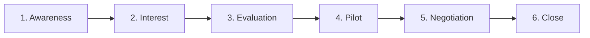

# Commercial Journey Map

**Status:** BUSINESS DESIGN. No code, API, migration, or `schema.prisma` change.
**Mission:** the complete commercial journey that turns a charging-network operator from "I've heard about MOVOS" into "I'm paying for MOVOS."
**Grounding:** MOVOS's own stated positioning — "the commercial, white-label SaaS platform for electric-vehicle charging infrastructure management... MediaFOX Forge builds and owns MOVOS as a product; individual charging operators (such as Kylum Energy) consume it as tenants" (`docs/product/MOVOS.md`). This is a B2B, multi-tenant SaaS sale to an operator organization, not a consumer purchase — every stage below is designed around that fact, not a generic funnel template.

## The six stages

### 1. Awareness — "I've heard about MOVOS"

- **Goal:** a charging-network operator learns MOVOS exists and that it solves a problem they recognize.
- **Primary actor:** usually an operations or fleet lead at a charging operator, not a developer — MOVOS's own module map (Resumen, Sitios, Estaciones, Sesiones) is operations vocabulary, not engineering vocabulary, and that should drive where awareness is built (operator trade press, industry associations, peer referral) over developer-channel tactics (technical blogs, API docs as top-of-funnel).
- **MOVOS's role:** be findable and legible to a non-technical operations buyer in one sentence — "an operations command center for your charging network," not a protocol/architecture pitch.
- **Exit criteria:** the prospect takes one deliberate action — visits a website, asks a peer for an intro, or attends a demo at an industry event.
- **Real risk here:** charging-network operators are a narrow, referral-dense market (regional utilities, fleet operators, property/HOA charging programs, roaming networks — see [ICP_AND_BUYER_PERSONAS.md](./ICP_AND_BUYER_PERSONAS.md)). Generic SaaS awareness tactics (broad content marketing, paid search) are likely to under-perform relative to direct outreach and industry-specific channels, simply because the buyer population is small and known to itself.

### 2. Interest — qualified lead

- **Goal:** the prospect engages enough to share their real operational situation — fleet size, current tooling, pain points — so MOVOS can be qualified in or out honestly.
- **Primary actor:** the same ops/fleet lead, now joined by whoever they loop in early (often IT, sometimes finance).
- **MOVOS's role:** a short, honest qualifying conversation, not a generic demo request form — what matters at this stage is fleet size, current pain (manual monitoring, no visibility across sites, no recommendation/action layer), and whether MOVOS's real, shipped feature set (see [SALES_MOTION_AND_GTM_STRATEGY.md](./SALES_MOTION_AND_GTM_STRATEGY.md)) actually matches what they need today, not what's on a future roadmap.
- **Exit criteria:** a scoping call happens and both sides agree there's a plausible fit worth a deeper look.
- **Real risk here:** over-promising against roadmap items (live OCPP hardware integration at full fleet scale, billing/invoicing, automation) that aren't real yet is the single easiest way to poison a relationship that later reaches Evaluation and discovers the gap. [TRUST_OBJECTIONS_AND_CONVERSION_METRICS.md](./TRUST_OBJECTIONS_AND_CONVERSION_METRICS.md) treats this directly.

### 3. Evaluation — technical and business fit

- **Goal:** the prospect's technical evaluator (often IT/security) and economic buyer (often a director/VP of operations) both conclude MOVOS is credible enough to justify a hands-on trial.
- **Primary actors:** the technical evaluator (security/data-isolation questions — see multi-tenancy, below) and the economic buyer (does this solve a problem worth paying to solve).
- **MOVOS's role:** answer the real, structural questions with real architecture, not marketing language — multi-tenant isolation is enforced server-side on every request (re-validated ACTIVE membership, org-scoped queries — `docs/product/MOVOS.md`'s own "Operational foundation" section), audit logging exists for every domain mutation (`AuditEvent`), and the Operator Control Center's Recommendation Engine and Action Center (WO-ARGOS-025/026) are real, shipped, tested capabilities, not concept slides.
- **Exit criteria:** both evaluator and buyer agree to a scoped Pilot rather than a purchase — this is a mission-critical operations tool (charging infrastructure directly touches revenue and driver experience), and no serious operator commits to paying before seeing it run against their own reality.
- **Real risk here:** treating Evaluation as a sales-pitch stage instead of a technical-diligence stage. An operator evaluating infrastructure software will look for the same rigor this engagement's own architecture docs already demonstrate (real migrations, real test evidence, honestly-named gaps) — that rigor is a sales asset here, not just an engineering discipline.

### 4. Pilot — proof

- **Goal:** MOVOS runs against the operator's real sites (or a representative subset) long enough to prove the value case concretely, with real data instead of a demo dataset.
- **Primary actor:** the day-to-day operations team who will actually use the product — the champion who has to want to keep using it, not just the buyer who has to want to pay for it.
- **MOVOS's role:** this stage is not hypothetical — **it is the exact relationship MOVOS already has with Kylum Energy today**, the product's own first pilot customer (`docs/product/MOVOS.md`). Every other prospect's Pilot stage should look like a repeat of that same motion: real sites, real (or realistically representative) data, the actual shipped Operator Control Center — fleet health, sessions, the Recommendation Engine, the Action Center — not a slide deck.
- **Exit criteria:** the champion can point to something concrete the pilot caught or improved — a chronic station surfaced, a resolved recommendation, a faster response time — and is willing to advocate internally for paying to continue.
- **Real risk here:** a pilot with no defined success criteria never converts, because there's no shared moment where both sides agree it worked. [TRUST_OBJECTIONS_AND_CONVERSION_METRICS.md](./TRUST_OBJECTIONS_AND_CONVERSION_METRICS.md) defines what "the pilot worked" should mean in measurable terms, not just a good feeling.

### 5. Negotiation — pricing and contract

- **Goal:** convert pilot success into a commercial agreement — package, price, term, and the boundary of what's included.
- **Primary actors:** the economic buyer and, for anything beyond a small operator, procurement/legal.
- **MOVOS's role:** present packaging tied to real capability boundaries (see [PRICING_AND_PACKAGING.md](./PRICING_AND_PACKAGING.md)) rather than an arbitrary tier split — an operator who piloted the Operator Control Center and Action Center should be quoted for exactly that, with a clear, honest line about what's not yet included (billing/invoicing, live OCPP at scale, Automation — all named explicitly elsewhere in this repository as not-yet-built, and that honesty belongs in the contract conversation, not just internal docs).
- **Exit criteria:** signed order form / contract, with pricing and scope both explicit.
- **Real risk here:** for white-label, multi-tenant infrastructure software, procurement and legal review (data processing terms, uptime expectations, security posture) can be the longest single stretch of the entire journey — longer than the technical evaluation itself. Budgeting realistic time for this, rather than treating "verbal yes" as equivalent to "closed," avoids false-positive pipeline reporting.

### 6. Close — "I'm paying for MOVOS"

- **Goal:** the contract is executed and the first payment is collected or invoiced under agreed terms — the literal conversion moment this journey is designed to reach.
- **Primary actor:** procurement/finance on the buyer side; whoever owns billing operations on the MediaFOX side (today, notably, MOVOS's own in-product billing foundation — `BillingAccount`/`TariffSnapshot`, CAP-008/009 — bills the operator's _own end drivers_, a completely different concern from MediaFOX invoicing the operator itself for MOVOS access; see the note in [PRICING_AND_PACKAGING.md](./PRICING_AND_PACKAGING.md) about not conflating the two).
- **MOVOS's role:** a clean handoff from "signed" to "live and being paid for," which is the natural bridge into onboarding/activation — deliberately out of this document's scope, since the mission asked for the journey up to "I'm paying," not the full post-sale lifecycle.
- **Exit criteria:** first invoice paid or first subscription charge collected.

## Where this journey is not hypothetical

Stage 4 deserves restating on its own: MOVOS does not need to imagine what a pilot-led sale looks like — it has run one, is still running it, and describes itself accordingly in its own product documentation ("Kylum Energy is the first pilot customer, not the product owner," `docs/product/MOVOS.md`). Every stage before Pilot in this map exists to produce more relationships that reach that same real, already-proven stage; every stage after it exists to turn that same proven relationship into revenue. [SALES_MOTION_AND_GTM_STRATEGY.md](./SALES_MOTION_AND_GTM_STRATEGY.md) picks up from here to recommend how deliberately to run that motion, repeatably, for the next prospect.
