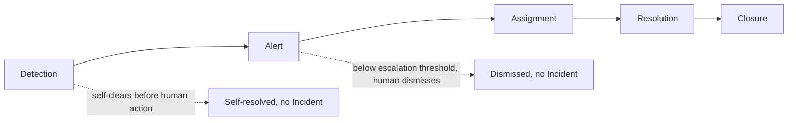
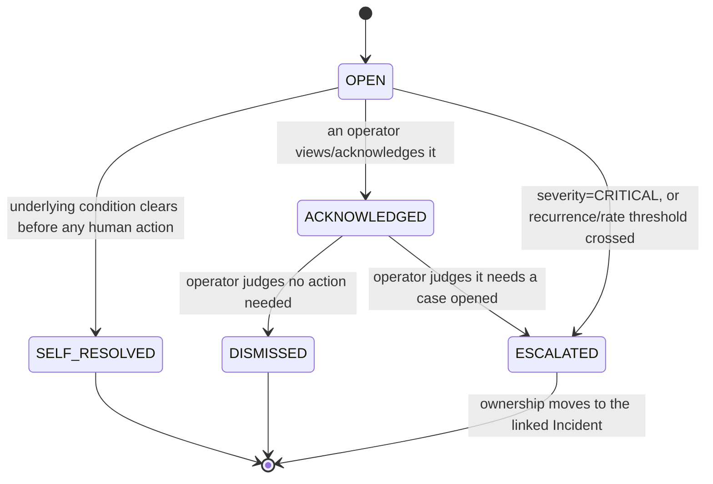
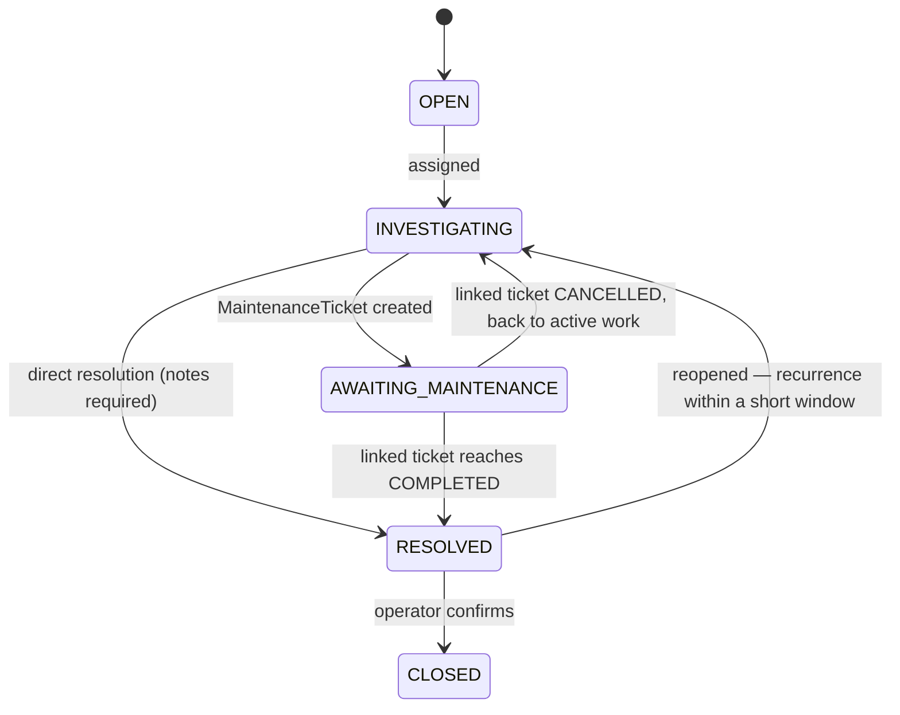

# CAP-X — Incident Flow

**Work order:** WO-ARGOS-019 (CAP-X Architecture)
**Status:** ARCHITECTURE ONLY. State machines and thresholds below are a specification, not implemented logic — no detection job, queue, or service exists yet.
**Part of:** [CAP-X_OPERATOR_DOMAIN.md](./CAP-X_OPERATOR_DOMAIN.md); entity fields referenced below are defined there.

## Objective 3 — The operational flow

### Overview

Not every `Alert` reaches `Closure` through a human — the two dotted exits above (self-resolution and dismissal) are first-class, expected outcomes, not failure paths. A detection pipeline that forces every raised signal through a full human workflow, even the ones that resolve themselves in under a minute, would recreate exactly the alert-fatigue problem [CAP-X_OPERATOR_DOMAIN.md](./CAP-X_OPERATOR_DOMAIN.md) and [CAP-X_STATION_HEALTH.md](./CAP-X_STATION_HEALTH.md) both explicitly design against.

### Stage 1 — Detection

A continuous evaluation layer watches the real signals already produced by CAP-002/CAP-004/CAP-005 — it does not poll or introduce new device telemetry; every input already exists in `schema.prisma` today. Proposed rules, each naming its exact data source and a concrete starting threshold (explicitly tunable, per [CAP-X_OPERATOR_DOMAIN.md](./CAP-X_OPERATOR_DOMAIN.md)'s closing caveat):

| Rule               | Source signal                                                                                    | Threshold (proposed)                                                                                                                                                                      | Produces                                                                                       |
| ------------------ | ------------------------------------------------------------------------------------------------ | ----------------------------------------------------------------------------------------------------------------------------------------------------------------------------------------- | ---------------------------------------------------------------------------------------------- |
| Station fault      | `Connector.status` or `Evse.status` transitions to `FAULTED`                                     | Immediate                                                                                                                                                                                 | `Alert(type=STATION_FAULT)`                                                                    |
| Connectivity lost  | `ChargingStation.connectivityStatus` transitions to `OFFLINE`                                    | Immediate (CAP-005 has already done the stale-verification work by the time this transition happens — no additional debounce needed)                                                      | `Alert(type=CONNECTIVITY_LOST)`                                                                |
| Session stuck      | `ChargingSession.status = OFFLINE` and `NOW() - updatedAt` exceeds the reconnect-recovery window | 15 minutes (reuses CAP-005's own existing reconnect window verbatim — a session that hasn't recovered by the time CAP-005 itself would stop expecting a reconnect is unambiguously stuck) | `Alert(type=SESSION_STUCK, severity=CRITICAL)`                                                 |
| Flapping connector | Count of `STATION_FAULT` alerts for the same connector within a rolling window                   | 3 occurrences within 24 hours                                                                                                                                                             | `Alert(type=FLAPPING_CONNECTOR, severity=WARNING)`, referencing the prior alerts it aggregates |
| High failure rate  | Share of `FAILED`/`CANCELLED` `ChargingSession`s for a station within a rolling window           | 30% of sessions over the last 2 hours, minimum 5 sessions (avoids false positives from a station that's simply had 1 of 2 sessions fail)                                                  | `Alert(type=HIGH_FAILURE_RATE, severity=WARNING)`                                              |

The "immediate" rules require no new aggregation infrastructure — they are triggered directly off an existing state transition. The "rolling window" rules (flapping, high failure rate) are the ones that depend on `OccupancySnapshot`-style historical data existing (see [CAP-X_OPERATOR_DOMAIN.md](./CAP-X_OPERATOR_DOMAIN.md)'s `OccupancySnapshot` entity and [OPERATOR_KPIS.md](../product/OPERATOR_KPIS.md)'s status-history gap) — a dependency this document states explicitly rather than assuming away.

### Stage 2 — Alert

Detection produces an `Alert` row in `OPEN` status. From there:

- **`SELF_RESOLVED`** requires the detection layer to also watch for the _reverse_ transition (e.g., `connectivityStatus` returning to `ONLINE`, a stuck session actually completing) and close the `Alert` automatically, with the timestamp and duration preserved for later analysis (a station that self-resolves in 30 seconds every day is itself a `FLAPPING_CONNECTOR`-shaped pattern worth surfacing, even though no single occurrence needed a human).
- **Immediate escalation** (`OPEN → ESCALATED` without a human touching `ACKNOWLEDGED` first) applies only to `CRITICAL`-severity alerts (`SESSION_STUCK`, and `STATION_FAULT`/`CONNECTIVITY_LOST` on a station identified as historically high-traffic for the current time of day — [OPERATOR_DAILY_WORKFLOW.md](../product/OPERATOR_DAILY_WORKFLOW.md)'s "money-losing-now" tier) — these do not wait for a human to notice them in a queue; an `Incident` opens immediately so the attention-queue widget ([CAP-X_WIDGETS.md](./CAP-X_WIDGETS.md)) surfaces it as already-a-case, not merely a raised flag.
- **`WARNING`/`INFO` alerts wait for either human acknowledgment or a recurrence threshold** — this is the mechanism that prevents a single, isolated `FAULTED` transition from opening a full incident case on its own; it takes either a human judgment call or a pattern (three occurrences, per the flapping rule above) to escalate.

### Stage 3 — Assignment

Escalation creates (or attaches to an existing) `Incident` in `OPEN` status, unassigned. Assignment is the moment ownership becomes a specific person's responsibility:

- **Auto-assignment is out of scope for this architecture** — no on-call rotation, load-balancing, or skill-routing logic is proposed. An `Incident` sits `OPEN`/unassigned until a `Membership` with role `OPERATOR`/`ADMIN`/`SUPPORT` claims it (self-assigns) or another such member assigns it to someone. This keeps the first version simple and defers a real scheduling problem (who's on call right now) that this discovery found no evidence justifying yet.
- **`Incident.status` moves to `INVESTIGATING`** the moment it's assigned — a visible signal on the dashboard distinguishing "nobody has picked this up yet" (`OPEN`, itself a signal something is wrong if it persists) from "someone is actively working it" (`INVESTIGATING`).
- **Multiple `Alert`s can attach to one `Incident`** at this stage too, not only at creation — if a second, related alert fires while an incident is already `INVESTIGATING` (e.g., the same flapping connector faults again mid-investigation), it attaches to the existing incident rather than opening a duplicate.

### Stage 4 — Resolution

Two distinct resolution paths, both ending in `Incident.status = RESOLVED`:

- **Direct resolution** — the assignee determines no physical remediation is needed (a phone call to a driver freed a stuck session, a station reconnected on its own mid-investigation, a false positive). `resolutionNotes` is required (a structured or free-text field — this document does not mandate which) before the transition is allowed; an incident cannot move to `RESOLVED` silently, the same "no silent disappearance" principle [OPERATOR_DASHBOARD.md](../product/OPERATOR_DASHBOARD.md) already established for the attention queue.
- **Maintenance-ticket resolution** — the assignee determines a technician needs to be dispatched, creating a `MaintenanceTicket` linked to the `Incident`. The `Incident` itself does not move to `RESOLVED` until the `MaintenanceTicket` reaches `COMPLETED` — the incident's own resolution is gated on the physical work actually finishing, not on the ticket merely being created.

(`AWAITING_MAINTENANCE` is a sub-state of the four-stage `Incident.status` model named in [CAP-X_OPERATOR_DOMAIN.md](./CAP-X_OPERATOR_DOMAIN.md) — that document's simplified `OPEN/INVESTIGATING/RESOLVED/CLOSED` is the field's actual enum; whether "awaiting maintenance" needs to be its own stored value or is just `INVESTIGATING` with a non-null linked `MaintenanceTicket` is an implementation-time modeling choice this diagram leaves open, flagged here rather than silently decided.)

**Reopening:** if the same station/connector produces a new `Alert` of the same type within a short window (proposed: 48 hours) of an `Incident`'s resolution, the new alert re-attaches to the existing `Incident` (moving it back to `INVESTIGATING`) rather than opening a fresh one — a fix that didn't actually hold should read as "still open," not as two unrelated events, both for the operator's own clarity and because it's the honest representation of what happened.

### Stage 5 — Closure

`RESOLVED → CLOSED` is a deliberate, separate, human-confirmed step — the audit-trail action, distinct from the fix itself. This exists because [OPERATOR_DAILY_WORKFLOW.md](../product/OPERATOR_DAILY_WORKFLOW.md) names "did support already know about this" as an operator anxiety that extends beyond the immediate incident to whoever needs to later verify what happened and when — a `CLOSED` incident with a `resolutionNotes` field and full `Alert` history attached is the artifact that answers that question after the fact, for an operator, a landlord, or a board (the condominium/mall customer shapes specifically named in the discovery).

- `CLOSED` is terminal — a closed incident is never directly reopened; a recurrence past the reopening window (48 hours, above) creates a genuinely new `Incident`, which may reference the prior one for context but does not mutate its closed record. This preserves closure as an honest historical fact, not a status that silently un-happens.

### Cross-reference: how this maps onto Objective 3's five named stages

| Work order stage        | This document's mechanism                                                               |
| ----------------------- | --------------------------------------------------------------------------------------- |
| Detección (detection)   | Stage 1 — rule-based evaluation over existing CAP-002/CAP-004/CAP-005 signals           |
| Alerta (alert)          | Stage 2 — `Alert` lifecycle, self-resolution and dismissal as first-class outcomes      |
| Asignación (assignment) | Stage 3 — `Incident` claimed by a `Membership` with an appropriate role                 |
| Resolución (resolution) | Stage 4 — direct or maintenance-ticket-gated resolution, required notes, reopening rule |
| Cierre (closure)        | Stage 5 — a separate, terminal, human-confirmed step                                    |
