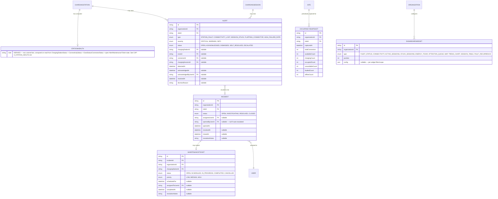

# CAP-X — Operator Control Center Domain

**Work order:** WO-ARGOS-019 (CAP-X Architecture)
**Status:** ARCHITECTURE ONLY. No `schema.prisma` change, migration, API, or UI is implied or authorized by this document. Every entity below is conceptual — a specification a future implementation work order would materialize, the same relationship CAP-008's documents (`docs/domain/CAP-008_BILLING_MODEL.md`) had to CAP-009's real schema.
**Builds on:** the WO-ARGOS-018 discovery set — [OPERATOR_DAILY_WORKFLOW.md](../product/OPERATOR_DAILY_WORKFLOW.md), [OPERATOR_MODULE_PRIORITY.md](../product/OPERATOR_MODULE_PRIORITY.md), [OPERATOR_KPIS.md](../product/OPERATOR_KPIS.md), [OPERATOR_DASHBOARD.md](../product/OPERATOR_DASHBOARD.md), [OPERATOR_STRATEGY_RECOMMENDATION.md](../product/OPERATOR_STRATEGY_RECOMMENDATION.md) — which recommended this capability's P0 tier (charger monitoring, alerts, map) ahead of CAP-010.

## Objective 1 — Domain boundary

### What this domain is

The Operator Control Center is an **observability and response domain**, not an operational-state domain. It answers "what is happening, who needs to know, and what did they do about it" — it does not own the facts it observes. Every entity in this domain either reads existing operational state (`ChargingStation`/`Evse`/`Connector`/`ChargingSession`/`ConnectivityStatus`, all real CAP-002/CAP-004/CAP-005 schema) or records a _human or system response_ to that state (an alert raised, an incident opened, a ticket dispatched). It never becomes a second source of truth for whether a charger is working — CAP-002/CAP-005 remain authoritative for that, exactly as this schema's own comments already insist for every existing status field (`ChargingStationStatus` is explicitly "administrative... NOT live operational state"; `ConnectivityStatus` is explicitly "deliberately distinct from ChargingStationStatus... EvseStatus/ConnectorStatus... and ChargingSessionStatus"). This domain adds a fifth lens — **response state** — without touching the four that already exist.

This framing resolves the one risk this kind of capability runs: inventing a second, competing notion of "is this station okay" that drifts from the real one. `StationHealth` (defined below) is explicitly a _derived_ view, computed from the four existing status dimensions plus this domain's own Alert/Incident data — never a field a human sets to declare a station healthy while its `ConnectivityStatus` says otherwise. The one narrow exception (`maintenance`, a genuine operator-declared override) is scoped and justified in [CAP-X_STATION_HEALTH.md](./CAP-X_STATION_HEALTH.md).

### What this domain is not

- **Not a billing domain.** No entity here computes cost, price, or debt. A `MaintenanceTicket`'s cost (if MOVOS ever tracks technician cost) is out of scope — that belongs to whatever capability eventually generalizes Commercial-domain cost tracking beyond charging sessions, not to this one.
- **Not a device-control domain.** Nothing here issues a remote command (`RemoteStart`/`RemoteStop`/`Reset`/`UnlockConnector` — Architecture Backlog #36–#40, all separately registered, all `UNDEFINED`). An operator resolving an incident by remotely resetting a station is a real future capability, but this domain only records _that_ a resolution happened and _how_ (a free-text/structured resolution note), not a device-control integration.
- **Not a driver-facing domain.** `Alert`/`Incident` are operator-internal. A driver never sees an `Alert` directly — if a driver-facing status page is ever built, it would read the same underlying `StationHealth`/`ConnectivityStatus` data this domain reads, not `Alert`/`Incident` themselves, which carry operator-internal detail (assignee, resolution notes) that has no business reaching a driver.

### Tenant scoping

Every entity below carries `organizationId`, following the precedent established by every tenant-scoped model in this schema since DEC-022 (`ChargingSession`, `AuthorizationCredential`, `BillingAccount`, `TariffSnapshot`) — an `Alert` never spans organizations, an `Incident` is never assigned to a user outside the owning organization's membership. Where an entity is naturally site-scoped (most of them — an operator triages per site far more often than per organization, per [OPERATOR_DAILY_WORKFLOW.md](../product/OPERATOR_DAILY_WORKFLOW.md)'s "which of my 40 sites needs me today" finding), `siteId` is carried alongside, denormalized the same way `ChargingSession` denormalizes `siteId`/`chargingStationId`/`evseId`/`connectorId` rather than forcing every query to walk the full ownership chain.

## Objective 2 — Conceptual entities

### Entity relationship overview

### Alert

The atomic unit of detection — one raised observation about one abnormal condition on one entity, created by the detection layer described in [CAP-X_INCIDENT_FLOW.md](./CAP-X_INCIDENT_FLOW.md), never created directly by a user. An `Alert` is deliberately narrow: it names _what_ was observed and _where_, not what should be done about it — that's `Incident`'s job.

- **Types**, drawn directly from the anxieties named in [OPERATOR_DAILY_WORKFLOW.md](../product/OPERATOR_DAILY_WORKFLOW.md): `STATION_FAULT` (a connector/EVSE entered `FAULTED`), `CONNECTIVITY_LOST` (a station's `ConnectivityStatus` transitioned to `OFFLINE`), `SESSION_STUCK` (a `ChargingSession` has been `OFFLINE` past the reconnect-recovery window CAP-005 already implements), `FLAPPING_CONNECTOR` (a fault-recurrence threshold was crossed — [OPERATOR_KPIS.md](../product/OPERATOR_KPIS.md) KPI 10), `HIGH_FAILURE_RATE` (a station's `FAILED`/`CANCELLED` session rate crossed a threshold over a rolling window).
- **Severity** maps directly onto the three-tier ranking [OPERATOR_DAILY_WORKFLOW.md](../product/OPERATOR_DAILY_WORKFLOW.md) already established for the attention queue: `CRITICAL` (money-losing-now, stuck-session tier), `WARNING` (pattern/flapping tier), `INFO` (informational, e.g., a station reconnected inside the recovery window — logged for the audit trail, never surfaced in the attention queue itself).
- **Lifecycle status** is deliberately not just open/closed — see [CAP-X_INCIDENT_FLOW.md](./CAP-X_INCIDENT_FLOW.md) for the full state machine, including `SELF_RESOLVED` (the underlying condition cleared before any human acted — e.g., a station reconnected — which must be visually distinct from `DISMISSED` (a human decided it didn't warrant action) so the audit trail never conflates "the problem went away" with "someone decided to ignore it").
- **References are all nullable and typed per-alert**, not a single polymorphic "entityId" column — a `CONNECTIVITY_LOST` alert has no `connectorId`, a `SESSION_STUCK` alert has no meaningful `evseId` distinct from its session's own. This mirrors `AuthorizationAttempt`'s existing pattern in this schema (nullable `evseId`/`connectorId`, populated only when meaningful) rather than inventing a new polymorphic-reference convention this schema doesn't otherwise use.

### Incident

The operator-facing case — what a human is actually working on. Not every `Alert` becomes an `Incident`: a `SELF_RESOLVED` or auto-dismissed-as-noise `Alert` never does. An `Incident` groups one or more related `Alert`s (a flapping connector might raise five `STATION_FAULT` alerts before crossing the `FLAPPING_CONNECTOR` recurrence threshold that opens a single `Incident` covering all five) so an operator works one case, not five duplicate notifications.

- **Status** is a real four-stage lifecycle (`OPEN` → `INVESTIGATING` → `RESOLVED` → `CLOSED`), not a two-state open/closed flag, because [OPERATOR_DAILY_WORKFLOW.md](../product/OPERATOR_DAILY_WORKFLOW.md) explicitly distinguishes "the problem is fixed" from "someone confirmed and closed the case" — the same distinction real incident-management practice draws, and the same distinction this document's own [CAP-X_INCIDENT_FLOW.md](./CAP-X_INCIDENT_FLOW.md) needs to formalize the assignment/resolution/closure objective the work order names explicitly.
- **`assigneeUserId`** references the existing `User`/`Membership` model — this domain does not invent a new "operator" or "technician" identity concept. Assignment is constrained to a `Membership` with an appropriate `MemberRole` (`OPERATOR`, `ADMIN`, or `SUPPORT` — all three already exist in `schema.prisma`'s `MemberRole` enum) for the incident's `organizationId`; `VIEWER`/`ANALYST` memberships are not valid assignees, an application-level rule, not a database one, in this architecture.
- **`openedByUserId` is nullable** because most incidents will be system-escalated from an `Alert` crossing a severity/recurrence threshold, not manually opened — see [CAP-X_INCIDENT_FLOW.md](./CAP-X_INCIDENT_FLOW.md) for exactly which `Alert` conditions auto-escalate versus require a human to open an `Incident` manually.

### MaintenanceTicket

The physical-remediation record — created from an `Incident` only when the resolution requires dispatching a technician or scheduling work, not for every incident (a stuck session resolved by a phone call to the driver, or a station that reconnected on its own, never needs one). This is a deliberate, one-directional relationship: every `MaintenanceTicket` has exactly one owning `Incident`; not every `Incident` has a `MaintenanceTicket`.

- **Priority** (`LOW`/`MEDIUM`/`HIGH`) is set at creation from the originating `Incident`'s severity, but is independently editable afterward — a dispatcher may reprioritize based on information the automated severity calculation couldn't see (e.g., a HIGH-severity alert that turns out to be a five-minute cable-reseat job, or a LOW-severity alert that turns out to need a part on backorder).
- **No cost, no vendor, no parts-inventory fields** — deliberately minimal, mirroring `BillingAccount`'s own precedent of shipping the smallest field set an invariant actually requires rather than pre-building a full work-order-management system this discovery found no evidence of operator urgency for (Maintenance was classified P1 in [OPERATOR_MODULE_PRIORITY.md](../product/OPERATOR_MODULE_PRIORITY.md), and P1 modules are explicitly the ones evidence supports but sequencing defers, not modules to over-build once started).

### OccupancySnapshot

A periodic, append-only rollup of connector-status counts for a site (or station) at a point in time — the concrete mechanism that closes the "status-history log" gap [OPERATOR_KPIS.md](../product/OPERATOR_KPIS.md) names as blocking three separate KPIs (Fleet Uptime, Utilization Rate, Maintenance Incident Rate). Despite its name, this entity's real purpose is broader than the "Occupancy" module alone — it is the general-purpose status-history mechanism this domain needs, named for the KPI that most directly motivated it. This document uses the name the work order specified rather than inventing a more general one unprompted.

- **Append-only, never updated** — the same immutability discipline `TariffSnapshot` (CAP-009) already established in this schema for a different reason (frozen pricing terms); here the reason is that a historical rollup that could be edited after the fact is worthless as a trend source.
- **Capture cadence is a policy decision, not a per-row field** — this document specifies the entity's shape, not how often it's captured (every 5 minutes? Hourly? On every status transition, event-sourced style?). That is an implementation-time trade-off between storage volume and trend resolution, explicitly deferred to whichever future work order materializes this schema, the same way CAP-008 left `TariffSnapshot`'s exact triggering rule open for CAP-009 to resolve.
- **Scoped to `siteId`, not `chargingStationId`** — an operator's daily occupancy question is "is my site full," not "is this one station full" ([OPERATOR_DAILY_WORKFLOW.md](../product/OPERATOR_DAILY_WORKFLOW.md)'s "which of my 40 sites" framing again). A per-station breakdown remains derivable by filtering the underlying connector-status query the snapshot itself is built from; this table's grain is the one the dashboard's Occupancy widget actually needs.

### DashboardWidget

A configuration record — which widgets an organization's dashboard shows, in what order, with what scope filters (e.g., "this Fleet Status widget is scoped to Site X only," useful for a single-site condominium operator who has no use for a fleet-wide rollup). This is, honestly, the thinnest entity of the six in domain terms — it carries almost no business logic of its own, only presentation configuration, and every widget's actual _data_ comes from the other five entities plus existing CAP-002/CAP-004/CAP-005 schema (detailed per-widget in [CAP-X_WIDGETS.md](./CAP-X_WIDGETS.md)).

- **Open question, flagged rather than resolved:** does `DashboardWidget` need to be a persisted, per-organization-configurable entity at all in a first version, or can the dashboard ship with a fixed, non-configurable widget set (the exact set [OPERATOR_DASHBOARD.md](../product/OPERATOR_DASHBOARD.md) already described) and `DashboardWidget` persistence deferred until real customer demand for customization appears? This document models it as an entity because the work order asked for one, but the honest architectural position is that this is the single lowest-priority entity of the six to actually build, and a future implementation work order should re-examine whether it's needed at all in a first cut.

### StationHealth

Not a stored entity — a **derived, computed view**. See [CAP-X_STATION_HEALTH.md](./CAP-X_STATION_HEALTH.md) for the full definition of its five states and computation rules. It appears in the ER diagram above (dashed conceptually, though Mermaid's ER notation can't natively express "computed, not stored" any more than the Domain Map's own notation could when it first hit this same problem for implementation-status — see `M001-A_DOMAIN_MAP_v0.1.md`'s own note on this) because operators and the dashboard need to reason about it as if it were an entity, even though no table backs it directly.

## What this domain deliberately does not resolve

- The exact detection thresholds (how many minutes before `SESSION_STUCK` fires, how many recurrences before `FLAPPING_CONNECTOR` fires) are proposed with concrete starting values in [CAP-X_INCIDENT_FLOW.md](./CAP-X_INCIDENT_FLOW.md), but are explicitly tunable parameters, not hard-coded architectural facts — a future implementation should make them configurable, not just correct at whatever value this document proposes.
- Notification delivery (email, SMS, push, Slack) is out of scope entirely — this domain defines when an `Alert`/`Incident` is _created_, not how a human is _notified_ of it. That is a separate, later capability.
- Remote device control as a resolution mechanism (see "What this domain is not," above) — resolution notes are structured text, not an integration with `RemoteStart`/`RemoteStop`/`Reset`.
