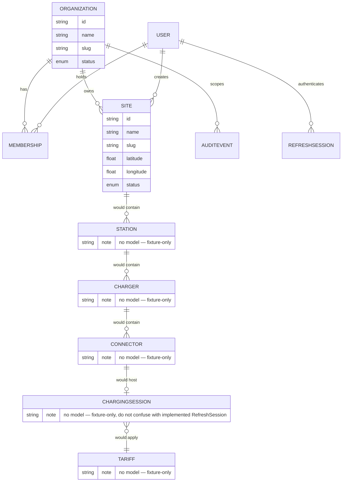
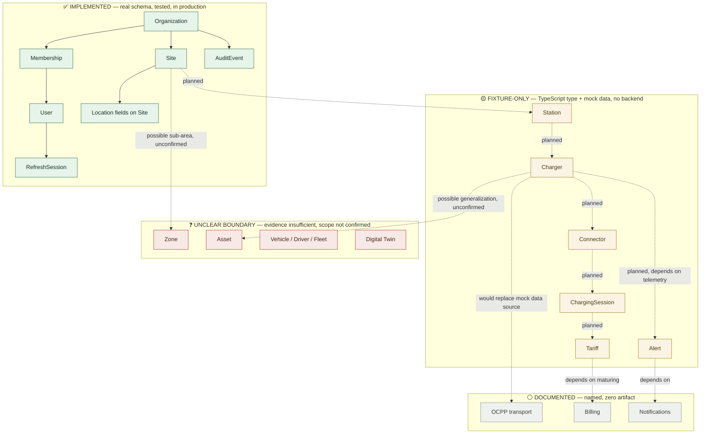

# M001-A — Domain Map v0.1

**Mission:** M001-A — Domain Research (in progress, owned by ARGOS)
**Generated:** 2026-07-24 · **Repository HEAD:** `main` @ `bfea8db` · **Baseline:** [MOVOS Product Atlas v1.0](../product/MOVOS_PRODUCT_ATLAS_v1.0.md)

Current-state domain map, based only on evidence recovered in the [Ubiquitous Language](./M001-A_UBIQUITOUS_LANGUAGE_v0.1.md) document. No candidate elements are introduced in this v0.1 — this baseline recovers what exists; it does not yet propose.

## Core entity relationships

_Mermaid's ER notation doesn't natively encode "implemented vs. fixture-only," so status is carried in each entity's `note` field above — `ORGANIZATION`, `SITE`, `MEMBERSHIP` (not pictured for space, see below), `USER`, `REFRESHSESSION`, and `AUDITEVENT` have no note because they are fully implemented; everything from `STATION` down is annotated as not yet modeled._

## Implementation-status view

## Reading this map

- **Implemented boundary:** everything inside `Organization → Membership/Site → AuditEvent` is real, tested, in production. This is the only region of the domain with an enforced multi-tenant boundary today (`OrgContextGuard` re-validates every request against this exact subgraph).
- **Fixture boundary:** Station through Alert form a single connected chain, entirely fixture-only, but — critically — **already internally consistent** in the frontend types (a mock Charger references a real `stationId`, a mock Connector references a real `chargerId`, etc.). This is why the [MVP Gap Analysis](../product/MOVOS_MVP_GAP_ANALYSIS_v1.0.md) treats formalizing this chain as reproducing an existing design, not inventing one.
- **Documented-only nodes** (OCPP, Billing, Notifications) have no shape yet at all — not even a fixture. They are placed downstream of the fixture chain because every mention of them in product docs assumes the fixture chain is real first.
- **Unclear-boundary nodes** (Zone, Asset, Vehicle/Driver/Fleet, Digital Twin) are drawn with dotted, unconfirmed edges because the repository contains no evidence establishing whether they connect to this domain at all. They are shown for completeness of the recovery mission, not because their placement is asserted as correct — each has a corresponding entry in [Open Decisions](./M001-A_OPEN_DECISIONS_v0.1.md).

## What this map deliberately omits

ForgeOS's own domain (Workspace, ARGOS, Missions-as-tracked-in-commits) is not pictured — recovered evidence shows zero dependency edges between it and MOVOS's domain (see [Ubiquitous Language — ARGOS](./M001-A_UBIQUITOUS_LANGUAGE_v0.1.md#argos)). Drawing them on the same diagram would imply a relationship that doesn't exist in code.
