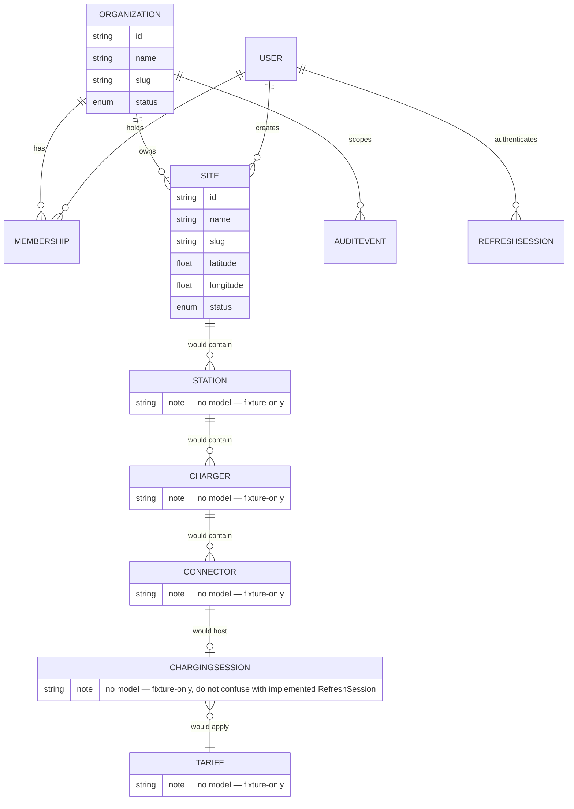
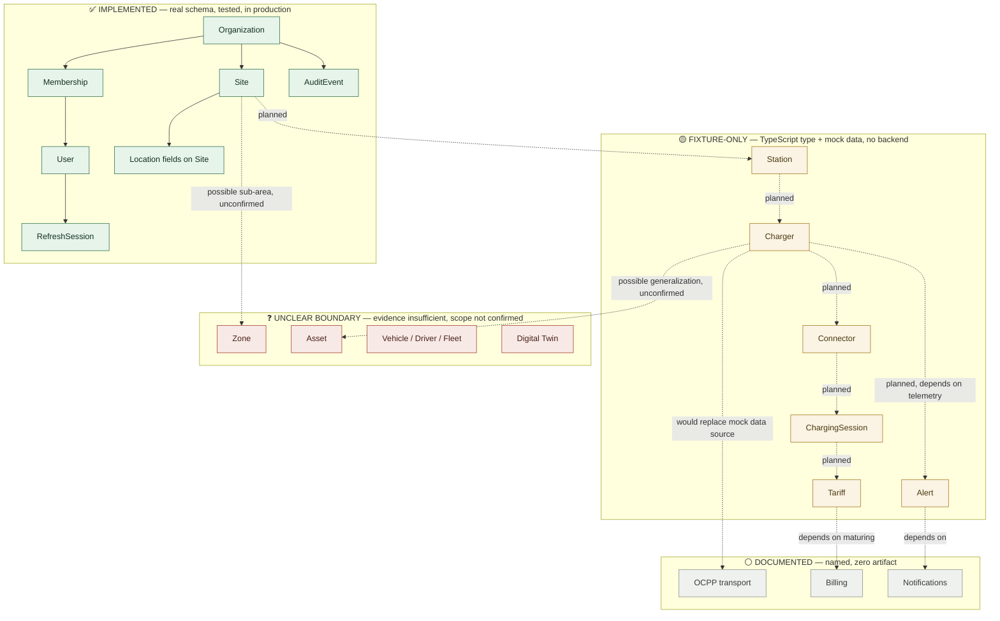
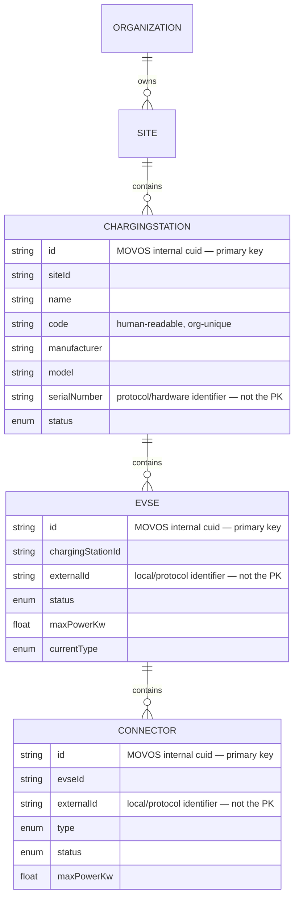
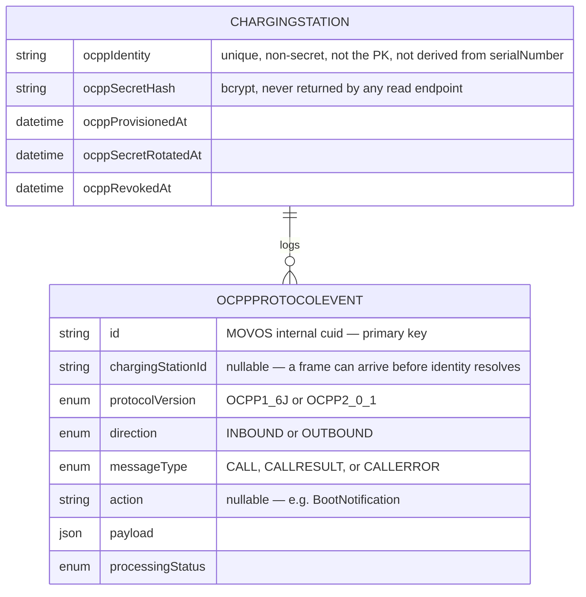
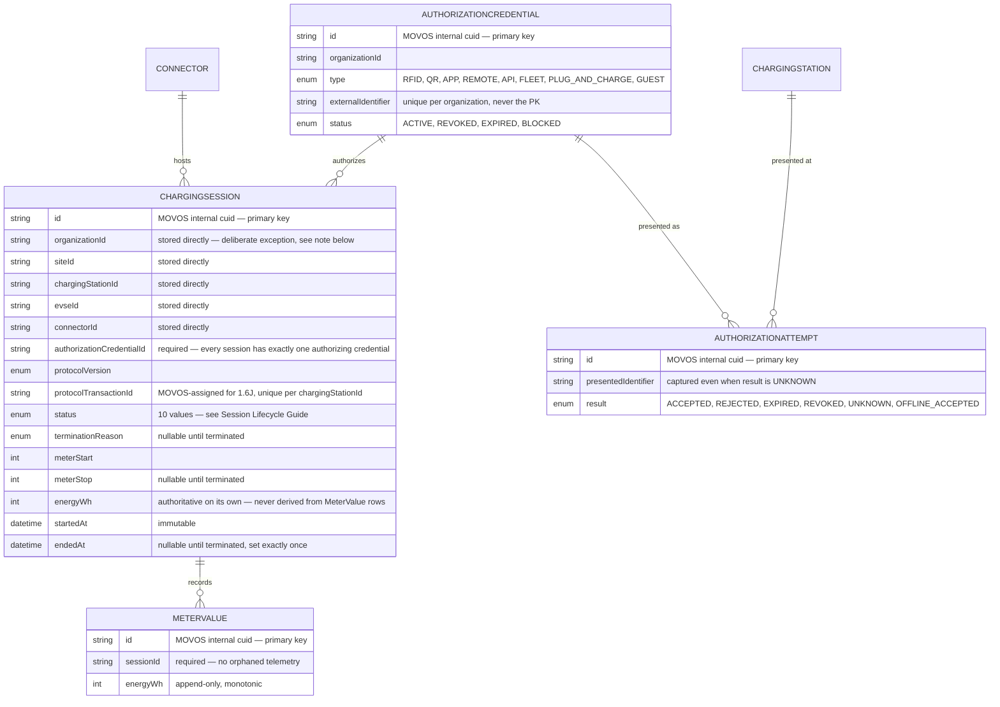
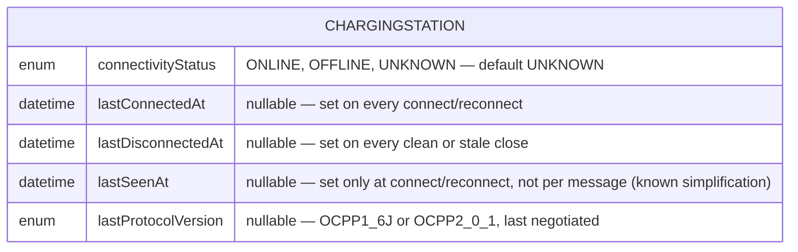
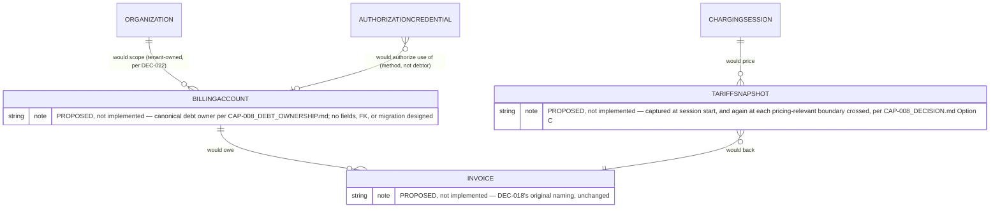

# M001-A — Domain Map v0.1

**Mission:** M001-A — Domain Research (in progress, owned by ARGOS)
**Generated:** 2026-07-24 · **Repository HEAD:** `main` @ `bfea8db` · **Baseline:** [MOVOS Product Atlas v1.0](../product/MOVOS_PRODUCT_ATLAS_v1.0.md)

Current-state domain map, based only on evidence recovered in the [Ubiquitous Language](./M001-A_UBIQUITOUS_LANGUAGE_v0.1.md) document. No candidate elements are introduced in this v0.1 — this baseline recovers what exists; it does not yet propose.

> **⚠️ 2026-07-24 update (WO-ARGOS-003):** M001-A-DEC-005 is now **approved** — see [Open Decisions](./M001-A_OPEN_DECISIONS_v0.1.md#m001-a-dec-005-approved-2026-07-24-wo-argos-003). The two diagrams immediately below (`Station → Charger → Connector`) are preserved exactly as originally recovered — they document the pre-decision, evidence-only state and are not edited. The **[approved current-state hierarchy](#approved-hierarchy-post-dec-005-2026-07-24)** is added further down this document, reflecting what CAP-002 actually implements.

## Core entity relationships


```mermaid
erDiagram
    ORGANIZATION ||--o{ MEMBERSHIP : has
    ORGANIZATION ||--o{ SITE : owns
    ORGANIZATION ||--o{ AUDITEVENT : scopes
    USER ||--o{ MEMBERSHIP : holds
    USER ||--o{ REFRESHSESSION : authenticates
    USER ||--o{ SITE : creates
    SITE ||--o{ STATION : "would contain"
    STATION ||--o{ CHARGER : "would contain"
    CHARGER ||--o{ CONNECTOR : "would contain"
    CONNECTOR ||--o| CHARGINGSESSION : "would host"
    CHARGINGSESSION }o--|| TARIFF : "would apply"

    ORGANIZATION {
        string id
        string name
        string slug
        enum status
    }
    SITE {
        string id
        string name
        string slug
        float latitude
        float longitude
        enum status
    }
    STATION {
        string note "no model — fixture-only"
    }
    CHARGER {
        string note "no model — fixture-only"
    }
    CONNECTOR {
        string note "no model — fixture-only"
    }
    CHARGINGSESSION {
        string note "no model — fixture-only, do not confuse with implemented RefreshSession"
    }
    TARIFF {
        string note "no model — fixture-only"
    }
```

_Mermaid's ER notation doesn't natively encode "implemented vs. fixture-only," so status is carried in each entity's `note` field above — `ORGANIZATION`, `SITE`, `MEMBERSHIP` (not pictured for space, see below), `USER`, `REFRESHSESSION`, and `AUDITEVENT` have no note because they are fully implemented; everything from `STATION` down is annotated as not yet modeled._

## Implementation-status view


```mermaid
flowchart TD
    subgraph Implemented["✅ IMPLEMENTED — real schema, tested, in production"]
        Org[Organization]
        Mem[Membership]
        Usr[User]
        RS[RefreshSession]
        Site[Site]
        Loc["Location fields on Site"]
        Aud[AuditEvent]
    end

    subgraph Fixture["🟡 FIXTURE-ONLY — TypeScript type + mock data, no backend"]
        Stn[Station]
        Chg[Charger]
        Con[Connector]
        CS[ChargingSession]
        Tar[Tariff]
        Alt[Alert]
    end

    subgraph Documented["⚪ DOCUMENTED — named, zero artifact"]
        OCPP[OCPP transport]
        Bill[Billing]
        Notif[Notifications]
    end

    subgraph Unclear["❓ UNCLEAR BOUNDARY — evidence insufficient, scope not confirmed"]
        Zone[Zone]
        Asset[Asset]
        Veh[Vehicle / Driver / Fleet]
        DTwin[Digital Twin]
    end

    Org --> Mem
    Mem --> Usr
    Usr --> RS
    Org --> Site
    Site --> Loc
    Org --> Aud

    Site -.->|planned| Stn
    Stn -.->|planned| Chg
    Chg -.->|planned| Con
    Con -.->|planned| CS
    CS -.->|planned| Tar
    Chg -.->|planned, depends on telemetry| Alt

    Chg -.->|would replace mock data source| OCPP
    Tar -.->|depends on maturing| Bill
    Alt -.->|depends on| Notif

    Site -.->|possible sub-area, unconfirmed| Zone
    Chg -.->|possible generalization, unconfirmed| Asset

    classDef implemented fill:#e6f4ea,stroke:#33724f,color:#173023
    classDef fixture fill:#fbf3e3,stroke:#a5791f,color:#4a3a12
    classDef documented fill:#eef1ee,stroke:#8d9089,color:#3a3c39
    classDef unclear fill:#f7e9e6,stroke:#a93f32,color:#4a201a

    class Org,Mem,Usr,RS,Site,Loc,Aud implemented
    class Stn,Chg,Con,CS,Tar,Alt fixture
    class OCPP,Bill,Notif documented
    class Zone,Asset,Veh,DTwin unclear
```

## Reading this map

- **Implemented boundary:** everything inside `Organization → Membership/Site → AuditEvent` is real, tested, in production. This is the only region of the domain with an enforced multi-tenant boundary today (`OrgContextGuard` re-validates every request against this exact subgraph).
- **Fixture boundary:** Station through Alert form a single connected chain, entirely fixture-only, but — critically — **already internally consistent** in the frontend types (a mock Charger references a real `stationId`, a mock Connector references a real `chargerId`, etc.). This is why the [MVP Gap Analysis](../product/MOVOS_MVP_GAP_ANALYSIS_v1.0.md) treats formalizing this chain as reproducing an existing design, not inventing one.
- **Documented-only nodes** (OCPP, Billing, Notifications) have no shape yet at all — not even a fixture. They are placed downstream of the fixture chain because every mention of them in product docs assumes the fixture chain is real first.
- **Unclear-boundary nodes** (Zone, Asset, Vehicle/Driver/Fleet, Digital Twin) are drawn with dotted, unconfirmed edges because the repository contains no evidence establishing whether they connect to this domain at all. They are shown for completeness of the recovery mission, not because their placement is asserted as correct — each has a corresponding entry in [Open Decisions](./M001-A_OPEN_DECISIONS_v0.1.md).

## What this map deliberately omits

ForgeOS's own domain (Workspace, ARGOS, Missions-as-tracked-in-commits) is not pictured — recovered evidence shows zero dependency edges between it and MOVOS's domain (see [Ubiquitous Language — ARGOS](./M001-A_UBIQUITOUS_LANGUAGE_v0.1.md#argos)). Drawing them on the same diagram would imply a relationship that doesn't exist in code.

---

## Approved hierarchy (post-DEC-005, 2026-07-24)

This section is new, added by WO-ARGOS-003 — it does not edit the pre-decision diagrams above. It reflects the domain as CAP-002 implements it.


```mermaid
erDiagram
    ORGANIZATION ||--o{ SITE : owns
    SITE ||--o{ CHARGINGSTATION : contains
    CHARGINGSTATION ||--o{ EVSE : contains
    EVSE ||--o{ CONNECTOR : contains

    CHARGINGSTATION {
        string id "MOVOS internal cuid — primary key"
        string siteId
        string name
        string code "human-readable, org-unique"
        string manufacturer
        string model
        string serialNumber "protocol/hardware identifier — not the PK"
        enum status
    }
    EVSE {
        string id "MOVOS internal cuid — primary key"
        string chargingStationId
        string externalId "local/protocol identifier — not the PK"
        enum status
        float maxPowerKw
        enum currentType
    }
    CONNECTOR {
        string id "MOVOS internal cuid — primary key"
        string evseId
        string externalId "local/protocol identifier — not the PK"
        enum type
        enum status
        float maxPowerKw
    }
```

**Ownership is enforced through `Site`, not a redundant `organizationId` on EVSE or Connector** — every access check walks the full parent chain (`Connector → EVSE → ChargingStation → Site → Organization`), matching the "do not trust IDs supplied by the client without checking the complete ownership chain" instruction this hierarchy was built under. See [CAP-002 Charging Terminology Mapping](./CAP-002_CHARGING_TERMINOLOGY_MAPPING.md) for how this reconciles with the frontend's existing `Station`/`Charger`/`Connector` types, and [`docs/product/MOVOS_DATABASE_INVENTORY_v1.0.md`](../product/MOVOS_DATABASE_INVENTORY_v1.0.md) for the authoritative, currently-accurate schema reference.

**Explicitly out of CAP-002's scope, not pictured here:** OCPP transport/messages, `ChargingSession`, `Tariff`, `Alert`, `Billing`, `Notifications` — all remain exactly as classified in the pre-decision diagrams above.

**2026-07-28 update (WO-ARGOS-004):** this hierarchy now has a connected `apps/movos-web` UI (`/sites/[id]/charging-stations/[id]`, `.../evses/[id]`), reusing the Sites frontend pattern. This does not change the diagram above — the domain shape is unchanged, only its frontend consumer. See [CAP-002 Charging Terminology Mapping — frontend integration addendum](./CAP-002_CHARGING_TERMINOLOGY_MAPPING.md#frontend-integration-addendum-wo-argos-004-2026-07-28).

---

## 2026-07-30 update (WO-ARGOS-007 / CAP-003): OCPP protocol boundary now partially real

This section is new, added by WO-ARGOS-007 — it does not edit any diagram above. The "Documented-only" classification of OCPP in the implementation-status flowchart (above) is now stale for the narrow slice described here; the flowchart itself is left unedited per this document's append-only discipline.

`ChargingStation` gained five OCPP fields (`ocppIdentity`, `ocppSecretHash`, `ocppProvisionedAt`, `ocppSecretRotatedAt`, `ocppRevokedAt`) and a new one-to-many relation to `OcppProtocolEvent`, an append-only log of raw protocol frames:


```mermaid
erDiagram
    CHARGINGSTATION ||--o{ OCPPPROTOCOLEVENT : logs

    CHARGINGSTATION {
        string ocppIdentity "unique, non-secret, not the PK, not derived from serialNumber"
        string ocppSecretHash "bcrypt, never returned by any read endpoint"
        datetime ocppProvisionedAt
        datetime ocppSecretRotatedAt
        datetime ocppRevokedAt
    }
    OCPPPROTOCOLEVENT {
        string id "MOVOS internal cuid — primary key"
        string chargingStationId "nullable — a frame can arrive before identity resolves"
        enum protocolVersion "OCPP1_6J or OCPP2_0_1"
        enum direction "INBOUND or OUTBOUND"
        enum messageType "CALL, CALLRESULT, or CALLERROR"
        string action "nullable — e.g. BootNotification"
        json payload
        enum processingStatus
    }
```

**What is real:** device identity/authentication (Decisions 1 & 2), an in-memory connection registry (no Redis, single-instance), and OCPP 1.6J `BootNotification`/`Heartbeat`/`StatusNotification` only. `StatusNotification` updates `Connector.status` (never `Evse.status` — see [OCPP Domain/Status Mapping](../engineering/OCPP_DOMAIN_STATUS_MAPPING.md) for the full field-level mapping and the deliberate lossy collapse of OCPP's richer status vocabulary into the existing 7-value `ConnectorStatus` enum).

**Explicitly still not pictured here, still out of scope:** `Authorize`/`StartTransaction`/`StopTransaction`, `ChargingSession`, RFID/`AuthorizationCredential`, `Tariff`, `Alert`, `Billing`, `Notifications`, and any functional OCPP 2.0.1 message handling (2.0.1 has a boundary-only adapter that explicitly rejects every message — see [OCPP 2.0.1 Architecture Guide](../engineering/OCPP_201_ARCHITECTURE_GUIDE.md)). Full conceptual design for all of these lives in [OCPP Protocol Coexistence](./OCPP_PROTOCOL_COEXISTENCE_v0.1.md), [MOVOS Authorization Architecture](./MOVOS_AUTHORIZATION_ARCHITECTURE_v0.1.md), and [MOVOS ChargingSession Architecture](./MOVOS_CHARGING_SESSION_ARCHITECTURE_v0.1.md) — architecture-approved, not implemented.

---

## 2026-07-31 update (WO-ARGOS-009 / CAP-004): the business layer above OCPP is now real

This section is new, added by WO-ARGOS-009 — it does not edit any diagram above. The "explicitly still not pictured" list immediately above is now stale for `ChargingSession`/`AuthorizationCredential`/`AuthorizationAttempt` specifically; left unedited per this document's append-only discipline.


```mermaid
erDiagram
    CONNECTOR ||--o{ CHARGINGSESSION : hosts
    AUTHORIZATIONCREDENTIAL ||--o{ CHARGINGSESSION : authorizes
    AUTHORIZATIONCREDENTIAL ||--o{ AUTHORIZATIONATTEMPT : "presented as"
    CHARGINGSESSION ||--o{ METERVALUE : records
    CHARGINGSTATION ||--o{ AUTHORIZATIONATTEMPT : "presented at"

    CHARGINGSESSION {
        string id "MOVOS internal cuid — primary key"
        string organizationId "stored directly — deliberate exception, see note below"
        string siteId "stored directly"
        string chargingStationId "stored directly"
        string evseId "stored directly"
        string connectorId "stored directly"
        string authorizationCredentialId "required — every session has exactly one authorizing credential"
        enum protocolVersion
        string protocolTransactionId "MOVOS-assigned for 1.6J, unique per chargingStationId"
        enum status "10 values — see Session Lifecycle Guide"
        enum terminationReason "nullable until terminated"
        int meterStart
        int meterStop "nullable until terminated"
        int energyWh "authoritative on its own — never derived from MeterValue rows"
        datetime startedAt "immutable"
        datetime endedAt "nullable until terminated, set exactly once"
    }
    AUTHORIZATIONCREDENTIAL {
        string id "MOVOS internal cuid — primary key"
        string organizationId
        enum type "RFID, QR, APP, REMOTE, API, FLEET, PLUG_AND_CHARGE, GUEST"
        string externalIdentifier "unique per organization, never the PK"
        enum status "ACTIVE, REVOKED, EXPIRED, BLOCKED"
    }
    AUTHORIZATIONATTEMPT {
        string id "MOVOS internal cuid — primary key"
        string presentedIdentifier "captured even when result is UNKNOWN"
        enum result "ACCEPTED, REJECTED, EXPIRED, REVOKED, UNKNOWN, OFFLINE_ACCEPTED"
    }
    METERVALUE {
        string id "MOVOS internal cuid — primary key"
        string sessionId "required — no orphaned telemetry"
        int energyWh "append-only, monotonic"
    }
```

**Deliberate exception to the Evse/Connector ownership pattern.** `ChargingSession` stores `organizationId`/`siteId`/`chargingStationId`/`evseId`/`connectorId` directly rather than deriving them through the parent chain the diagrams above use — a documented denormalization for the one table expected to have session-level query volume. See [CAP-004 Charging Sessions Foundation §2](./CAP-004_CHARGING_SESSIONS_FOUNDATION.md#2-domain-hierarchy).

**What is real:** the full model shown above, a validated session-lifecycle state machine (`SessionLifecycleService`), and `Authorize`/`StartTransaction`/`MeterValues`/`StopTransaction` handling for OCPP 1.6J. `AuthorizationDecision`, envisioned as a separate entity in the CAP-003-era Authorization Architecture, is retired — `AuthorizationAttempt.result` carries the outcome directly.

**Explicitly still not pictured here, still out of scope:** `Tariff`, `Alert`, `Billing`, `Notifications`, `Driver`/`Vehicle`/`Fleet` (referenced only conceptually via `AuthorizationCredential.ownerRef`, which does not exist as a column), Local Authorization List sync, RemoteStart/RemoteStop, functional OCPP 2.0.1. See [CAP-004 §11](./CAP-004_CHARGING_SESSIONS_FOUNDATION.md#11-out-of-scope-in-this-work-order) for the complete list.

**Validation level:** unit-tested only (mocked Prisma) as of this work order — no live-database or real-WebSocket run has been performed for this vertical, unlike CAP-003's OCPP transport (separately validated under WO-ARGOS-008). See the WO-ARGOS-009 Final Report for the exact claim. (Superseded by WO-ARGOS-009A/009's later live-database/real-WebSocket validation and, for the OFFLINE/reconnect path specifically, by the 2026-08-02 update immediately below — left unedited here per this document's append-only discipline.)

---

## 2026-08-02 update (WO-ARGOS-010 / CAP-005): connectivity is now real, wired to sessions

This section is new — it does not edit any diagram above. `ChargingStation` gains 5 persisted connectivity fields (no new entity); `ConnectivityCoordinator` is the new seam connecting the CAP-003 connection registry to the CAP-004 session lifecycle for the first time.


```mermaid
erDiagram
    CHARGINGSTATION {
        enum connectivityStatus "ONLINE, OFFLINE, UNKNOWN — default UNKNOWN"
        datetime lastConnectedAt "nullable — set on every connect/reconnect"
        datetime lastDisconnectedAt "nullable — set on every clean or stale close"
        datetime lastSeenAt "nullable — set only at connect/reconnect, not per message (known simplification)"
        enum lastProtocolVersion "nullable — OCPP1_6J or OCPP2_0_1, last negotiated"
    }
```

```
ConnectionRegistryService (CAP-003, in-memory)
        │ register() / unregister() / sweepStale()
        ▼
ConnectivityCoordinator (CAP-005, new)
        │ persists ChargingStation connectivity fields
        │ only a verified-STALE close reaches further:
        ▼
SessionLifecycleService.suspendSession(id, 'OFFLINE')  (CAP-004)
```

**What is real:** `ConnectivityStatus`/`ConnectivityEvent` types, `ConnectivityCoordinator` (startup reconciliation, connect/reconnect handling, stale-close session-OFFLINE transition, bounded reconnect-recovery), the 5 persisted `ChargingStation` fields, and connectivity fields surfaced in the existing station API responses and the `apps/movos-web` station list/detail views.

**Explicitly still not pictured here, still out of scope:** RFID-specific behavior, billing/tariffs/payments, remote start/stop, functional OCPP 2.0.1, Redis/multi-instance connection routing, SLA/uptime analytics. A clean (non-stale) disconnect still does **not** move a session to `OFFLINE` — a documented, deliberate limitation (see [CAP-005 §4](./CAP-005_CONNECTIVITY_ENGINE.md#4-known-deliberate-asymmetry-clean-disconnect-vs-stale)), not an oversight.

**Validation level:** real-boot/real-Postgres/real-WebSocket validated — a compiled `apps/movos-api` instance, real local PostgreSQL, and the repository's real `OcppSimulator` proved connect→ONLINE, a real idle-past-threshold stale close→station and session both OFFLINE, and a genuine reconnect→session recovered to ACTIVE with exactly one session throughout. See [CAP-005 Connectivity Engine](./CAP-005_CONNECTIVITY_ENGINE.md) and the [Connectivity Runtime Guide](../engineering/CONNECTIVITY_RUNTIME_GUIDE.md).

---

## 2026-08-03 update (WO-ARGOS-016/016A / CAP-008): Billing's domain shape is now decided — architecture only, zero schema

This section is new — it does not edit any diagram above. `Billing` moves from the "⚪ DOCUMENTED — named, zero artifact" bucket in the implementation-status flowchart to something the flowchart's own three-tier legend has no box for yet: **fully architected, still zero schema.** The flowchart itself is left unedited per this document's append-only discipline; this section is the correction.


```mermaid
erDiagram
    ORGANIZATION ||--o{ BILLINGACCOUNT : "would scope (tenant-owned, per DEC-022)"
    BILLINGACCOUNT ||--o{ INVOICE : "would owe"
    CHARGINGSESSION ||--o{ TARIFFSNAPSHOT : "would price"
    TARIFFSNAPSHOT }o--|| INVOICE : "would back"
    AUTHORIZATIONCREDENTIAL }o--o| BILLINGACCOUNT : "would authorize use of (method, not debtor)"

    BILLINGACCOUNT {
        string note "PROPOSED, not implemented — canonical debt owner per CAP-008_DEBT_OWNERSHIP.md; no fields, FK, or migration designed"
    }
    TARIFFSNAPSHOT {
        string note "PROPOSED, not implemented — captured at session start, and again at each pricing-relevant boundary crossed, per CAP-008_DECISION.md Option C"
    }
    INVOICE {
        string note "PROPOSED, not implemented — DEC-018's original naming, unchanged"
    }
```

**What is real:** nothing pictured above. This update is documentation only — no Prisma model, migration, field, or line of application code was written. What changed is that the _shape_ of Billing is no longer an open question: `CAP-008_BILLING_MODEL.md` names the billable entity (`ChargingSession`, generating revenue) as structurally distinct from the debt-owning entity (`BillingAccount`, a new concept — `CAP-008_DEBT_OWNERSHIP.md` — chosen over `Organization`/`Driver`/`Vehicle`/`Fleet`/`AuthorizationCredential`, all evaluated and rejected); `CAP-008_DECISION.md` names when pricing is captured (`TariffSnapshot`, at session start and at each pricing-relevant boundary, degenerating to a single snapshot for any session that crosses none); and `CAP-008_BILLING_THREAT_MODEL.md`/`CAP-008_SCENARIOS.md` validate both against 7 financial-integrity threats and 5 deployment shapes.

**Explicitly still out of scope, still not implemented:** `Invoice`, `Payment`, `Refund`, `Tax`, `Discount`, any Stripe or accounting integration, and any UI. `Driver`/`Vehicle`/`Fleet` remain exactly as classified in every prior section of this map (named, unimplemented) — CAP-008 evaluated them as debt-owner _candidates_ and rejected all three; it did not change their implementation status.

**Next capability:** CAP-009 — `BillingAccount` & `TariffSnapshot` Foundation, registered in the [Architecture Backlog](../architecture/MOVOS_ARCHITECTURE_BACKLOG_v1.0.md), not started.

**Validation level:** N/A — no code exists to validate. See [CAP-008_BILLING_MODEL.md](./CAP-008_BILLING_MODEL.md), [CAP-008_DECISION.md](./CAP-008_DECISION.md), [CAP-008_DEBT_OWNERSHIP.md](./CAP-008_DEBT_OWNERSHIP.md), [CAP-008_BILLING_THREAT_MODEL.md](../reviews/CAP-008_BILLING_THREAT_MODEL.md), and [CAP-008_SCENARIOS.md](../reviews/CAP-008_SCENARIOS.md).
