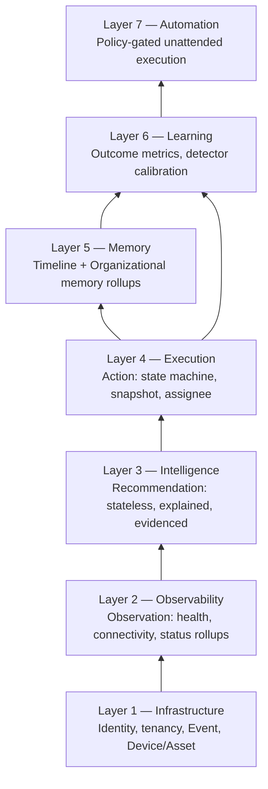

# The ForgeOS Stack

**Work order:** WO-ARGOS-028 (ForgeOS Core Extraction)
**Status:** ARCHITECTURE DISCOVERY. No code, API, migration, or `schema.prisma` change. Every "shipped" claim below points at real code on `main`; every "not built" claim is stated as plainly as the shipped ones.
**Mission:** arrange [UNIVERSAL_PRIMITIVES.md](./UNIVERSAL_PRIMITIVES.md)'s primitives and [VERTICAL_BOUNDARIES.md](./VERTICAL_BOUNDARIES.md)'s universal column into the seven layers of a first ForgeOS stack.

## Why this order

Each layer depends on the one below it — this isn't an aesthetic choice, it's the same dependency chain [UNIVERSAL_PRIMITIVES.md](./UNIVERSAL_PRIMITIVES.md) already found in the data: Observability reads raw facts Infrastructure recorded; Intelligence reads what Observability concluded; Execution acts on what Intelligence suggested; Memory summarizes what Execution closed; Learning grades what Memory shows; Automation only gets to act once Learning says it's safe to. [LEARNING_STRATEGY.md](../product/LEARNING_STRATEGY.md) already found this exact dependency in miniature — Automation cannot be trusted without Learning's per-type confidence data — this stack generalizes that one finding into a full ordering.

_(Layer 4 feeds Layer 6 directly, not just through Layer 5 — Learning's metrics in [LEARNING_METRICS.md](../product/LEARNING_METRICS.md) are computed straight from `Action` outcomes, not from a Memory rollup of them.)_

## The seven layers

### Layer 1 — Infrastructure

- **Purpose:** identity, tenancy, and the raw, immutable record of what happened — the ground everything else stands on.
- **ForgeOS Core owns:** multi-tenant `User`/`Organization`/`Membership` with role-based access, authentication (`RefreshSession`), human-attributable audit logging (`AuditEvent`), a unified **Event** primitive (today four independent tables — `MeterValue`, `AuthorizationAttempt`, `OcppProtocolEvent`, `AuditEvent` — each re-solving "immutable, timestamped, attributable fact" from scratch), and a generic **Device/Asset** hierarchy (today hardcoded as `ChargingStation → Evse → Connector`).
- **Maturity:** **Shipped and already vertical-agnostic** for the identity/tenancy/audit piece — see [VERTICAL_BOUNDARIES.md](./VERTICAL_BOUNDARIES.md)'s finding that `User`/`Organization`/`Membership` carry zero mobility-specific fields today. **Shipped but MOVOS-bound** for Event and Device/Asset — the four Event-shaped tables and the three-level device topology work today, just not under a shared, vertical-agnostic shape yet.
- **MOVOS's role at this layer:** owns the concrete device types (`ChargingStation`, `Evse`, `Connector`) and concrete event types (`MeterValue`, `AuthorizationAttempt`) as specializations of Core's generic shapes.

### Layer 2 — Observability

- **Purpose:** turn raw Events into a current judgment about an entity's state — the **Observation** primitive.
- **ForgeOS Core owns:** the rollup mechanism — walk an asset hierarchy, apply a defined precedence between evidence types (liveness before fault), produce a small verdict enum, computed fresh rather than stored.
- **Maturity:** **Shipped, MOVOS-bound.** `StationHealthService.computeHealth()` (CAP-X Sprint 1) already implements exactly this mechanism, with zero charging-specific _reasoning_ in the precedence logic — only charging-specific field names. `ConnectivityCoordinatorService` (CAP-005) is the same story for the persisted-Observation shape.
- **MOVOS's role at this layer:** supplies the concrete topology (`station → evses → connectors`) and the concrete verdict vocabulary (`healthy`/`degraded`/`offline`/`unknown`).

### Layer 3 — Intelligence

- **Purpose:** turn Observations (and raw Events) into an evidenced, explained **Recommendation** — the first layer whose output exists specifically to be acted on.
- **ForgeOS Core owns:** the detector contract — stateless, recomputed fresh, evidenced, never persisted, capped at one worst-instance result per detector so a UI's "maximum N cards" constraint holds by construction rather than by display-layer truncation.
- **Maturity:** **Shipped, MOVOS-bound.** `RecommendationService` (WO-ARGOS-025) implements the contract faithfully; all five concrete detectors are charging-specific and stay in MOVOS.
- **MOVOS's role at this layer:** owns every concrete detector (`ENERGY_ANOMALY`, `AUTH_FAILURE_SPIKE`, `IDLE_CONNECTOR`, `COMPARATIVE_UNDERPERFORMANCE`, `EFFICIENCY_DRIFT`) — Core supplies the shape they must conform to, not their logic.

### Layer 4 — Execution

- **Purpose:** turn a Recommendation into a durable, worked case — the **Action** primitive, and the first layer with real persisted state.
- **ForgeOS Core owns:** essentially the whole thing — snapshot-on-first-interaction, a server-enforced state-transition map, an assignee, free-text resolution notes, a cooldown-gated re-eligibility window.
- **Maturity:** **Shipped, already ~95% vertical-agnostic.** [CAPABILITY_INVENTORY.md](./CAPABILITY_INVENTORY.md) classified this the strongest Core candidate of all eight capabilities reviewed — only two foreign keys (`chargingStationId`, `recommendationType`) tie it to MOVOS.
- **MOVOS's role at this layer:** supplies what the `Action` points at — a `ChargingStation` and a `RecommendationType` — nothing more.

### Layer 5 — Memory

- **Purpose:** roll up many closed Actions (and the Events under them) into durable, longitudinal facts about a subject — chronic problems, reliable handlers, recurring patterns.
- **ForgeOS Core owns:** the rollup shape itself, and — the one genuine gap this whole discovery surfaced — the **Timeline** primitive: an ordered, append-only history of a subject's transitions, which does not exist anywhere today. `Action` overwrites `status`/`assignedToUserId`/`snoozedUntil` in place; without Timeline, Memory has to work from final-state-only data, exactly the caveat [ORGANIZATIONAL_MEMORY.md](../product/ORGANIZATIONAL_MEMORY.md) named for "best operators."
- **Maturity:** **Designed, not built.** [ORGANIZATIONAL_MEMORY.md](../product/ORGANIZATIONAL_MEMORY.md) (WO-ARGOS-027) defines the five target questions as pure discovery; Timeline has no implementation anywhere in the codebase.
- **MOVOS's role at this layer:** supplies which entities are worth remembering about (stations, operators) — Core would supply the rollup and Timeline mechanics.

### Layer 6 — Learning

- **Purpose:** grade whether Intelligence's Recommendations are actually working, and feed that grade back toward recalibrating detector thresholds.
- **ForgeOS Core owns:** the metric definitions (time to resolution, recurrence rate, acceptance rate, false-positive rate) as generic outcome measurements over any Action/Recommendation pairing, plus the attribution logic (which detector produced which outcome).
- **Maturity:** **Designed, not built.** [LEARNING_METRICS.md](../product/LEARNING_METRICS.md) (WO-ARGOS-027) defines these metrics and is honest that 3 of 5 are computable today with zero schema change, while false-positive rate and avoided downtime need either a schema addition or an accepted proxy.
- **MOVOS's role at this layer:** supplies nothing vertical-specific here — this is the layer where MOVOS's residue is smallest, since "did this detector's suggestions turn out to be right" is measured identically regardless of what the detector actually checks.

### Layer 7 — Automation

- **Purpose:** execute an Action transition without a human in the loop, once Learning says a given source is trustworthy enough to act on unattended.
- **ForgeOS Core owns:** a policy layer that reuses Layer 4's exact transition mechanism, gated by Layer 6's confidence data instead of launch-time guesswork.
- **Maturity:** **Not started, explicitly and repeatedly.** Held back across WO-ARGOS-026, WO-ARGOS-027, and this work order's own instructions. [LEARNING_STRATEGY.md](../product/LEARNING_STRATEGY.md) already found the reason this is correct: there is currently no way to know which of the 5 `RecommendationType`s are reliable enough to automate a response for, because Layer 6 doesn't exist yet either.
- **MOVOS's role at this layer:** would define which specific transitions, for which specific recommendation types, are candidates for automation — a policy decision, not a technical one, and one that shouldn't be made before Layer 6 exists to inform it.

## Stack maturity, at a glance

| Layer             | Primitive                    | Maturity                                                 | Vertical residue                      |
| ----------------- | ---------------------------- | -------------------------------------------------------- | ------------------------------------- |
| 1. Infrastructure | Event, Device/Asset, tenancy | Shipped (tenancy: Core-clean; Event/Device: MOVOS-bound) | Low (tenancy), Medium (Event/Device)  |
| 2. Observability  | Observation                  | Shipped, MOVOS-bound                                     | Medium (topology hardcoded)           |
| 3. Intelligence   | Recommendation               | Shipped, MOVOS-bound                                     | High (all 5 detectors)                |
| 4. Execution      | Action                       | Shipped, ~Core                                           | Low (2 foreign keys)                  |
| 5. Memory         | Timeline, Memory             | Designed only                                            | Unknown — no code to assess           |
| 6. Learning       | Learning                     | Designed only                                            | Low, by design                        |
| 7. Automation     | Automation                   | Not started                                              | Unknown — depends entirely on Layer 6 |

## What this stack is not proposing

This document does not propose a build order, a migration plan, or a schema for any unbuilt layer — that would be implementation, out of scope for WO-ARGOS-028. It proposes a _shape_: the seven layers already exist in the code's own dependency order, three of them (Observability, Intelligence, Execution) already built once for mobility, one (Infrastructure's tenancy piece) already built vertical-agnostic from day one, and three (Memory, Learning, Automation) still only ideas. [FORGEOS_POSITIONING.md](./FORGEOS_POSITIONING.md) answers what kind of thing this stack, taken as a whole, actually is.
