# CAP-X — Component Map

**Work order:** WO-ARGOS-021 (Operator Control Center Implementation Plan)
**Status:** PLANNING ONLY. Component and service names below are proposed identifiers for a future implementation — no file, class, or route is created by this document.
**Builds on:** [CAP-X_CONTRACTS.md](../domain/CAP-X_CONTRACTS.md) (service interfaces), [CAPX_MVP_SCREENS.md](../product/CAPX_MVP_SCREENS.md) (screen layout), [CAPX_SPRINT_PLAN.md](./CAPX_SPRINT_PLAN.md) (sequencing).

## Objective 2 — Frontend components, backend services, contracts, dependencies

### Reading this map

Each row names: the frontend component, the backend service it calls (from [CAP-X_CONTRACTS.md](../domain/CAP-X_CONTRACTS.md) where one is defined, or "existing" where it reads current CAP-002/CAP-004/CAP-005 services directly), and what it depends on before it can be built. Grouped by sprint, matching [CAPX_SPRINT_PLAN.md](./CAPX_SPRINT_PLAN.md).

### Sprint 1 components

| Frontend component                      | Backend service                                                                                                          | Depends on                                                                                                                                                                                                                                                                                                                                                                                                                                                                                                                                                                                                                                      |
| --------------------------------------- | ------------------------------------------------------------------------------------------------------------------------ | ----------------------------------------------------------------------------------------------------------------------------------------------------------------------------------------------------------------------------------------------------------------------------------------------------------------------------------------------------------------------------------------------------------------------------------------------------------------------------------------------------------------------------------------------------------------------------------------------------------------------------------------------- |
| `FleetStatusWidget`                     | `StationHealthService.summarizeFleet()`                                                                                  | `StationHealthService.computeHealth()` existing per-station (built first, this widget is its rollup)                                                                                                                                                                                                                                                                                                                                                                                                                                                                                                                                            |
| `ConnectivityWidget`                    | `StationHealthService.summarizeConnectivity()`                                                                           | Same                                                                                                                                                                                                                                                                                                                                                                                                                                                                                                                                                                                                                                            |
| `ActiveSessionsWidget`                  | Existing session-read service (no new contract)                                                                          | Nothing new — `ChargingSession.status` query only                                                                                                                                                                                                                                                                                                                                                                                                                                                                                                                                                                                               |
| `StuckSessionsWidget`                   | Existing session-read service, extended with an age filter (no new contract, new query)                                  | Nothing new                                                                                                                                                                                                                                                                                                                                                                                                                                                                                                                                                                                                                                     |
| `EnergyTodayWidget`                     | Existing session-read service, extended with a `SUM`/date-range aggregation (no new contract, new query)                 | Nothing new                                                                                                                                                                                                                                                                                                                                                                                                                                                                                                                                                                                                                                     |
| `FleetMap`                              | `StationHealthService.summarizeBySite()`                                                                                 | **Extends, does not replace, the existing `SiteMap` component** (`apps/movos-web/src/components/location/site-map.tsx`, built on `@vis.gl/react-google-maps`, already production-proven for the Location capability). The existing component renders exactly one static, non-interactive marker (`gestureHandling="none"`, `disableDefaultUI`) — `FleetMap` needs multi-marker rendering, status-color-coded markers, and click-through, which the current component does not do. The Google Maps API key plumbing (`NEXT_PUBLIC_GOOGLE_MAPS_BROWSER_API_KEY`) and library choice are already established and should be reused, not re-decided. |
| `SessionTable`                          | Existing session-read service, extended with filter/sort parameters (no new contract, new query surface)                 | Nothing new                                                                                                                                                                                                                                                                                                                                                                                                                                                                                                                                                                                                                                     |
| `StationDetailView` (Vista de estación) | `StationHealthService.computeHealth()` (single-station) + existing station/EVSE/connector read + `SessionTable` filtered | `FleetStatusWidget`'s underlying per-station computation, reused, not duplicated                                                                                                                                                                                                                                                                                                                                                                                                                                                                                                                                                                |

**No new NestJS module is required for Sprint 1's status-strip widgets** — every one of them is a new query/aggregation method on top of existing read paths. `StationHealthService` is the one genuinely new backend unit in this sprint, and it has no persistence layer of its own (per [CAP-X_STATION_HEALTH.md](../domain/CAP-X_STATION_HEALTH.md), it is a pure computation).

### Sprint 2 components

| Frontend component                                              | Backend service                                                                                                                                                                                                                                                  | Depends on                                                                                                                                                                                                                                                       |
| --------------------------------------------------------------- | ---------------------------------------------------------------------------------------------------------------------------------------------------------------------------------------------------------------------------------------------------------------- | ---------------------------------------------------------------------------------------------------------------------------------------------------------------------------------------------------------------------------------------------------------------- |
| `AttentionQueuePanel`                                           | `IncidentService.listAttentionQueue()`                                                                                                                                                                                                                           | `AlertService`, `IncidentService`, and the migration landing first                                                                                                                                                                                               |
| `AlertDetectionWorker` (not a UI component — a backend process) | `AlertDetectionService`                                                                                                                                                                                                                                          | Real event/transition hooks into `ConnectivityCoordinator` (CAP-005), `SessionLifecycleService` (CAP-004/CAP-005), and the connector-fault write path (CAP-002/CAP-003) — see [CAPX_RISK_MATRIX.md](./CAPX_RISK_MATRIX.md) for the integration risk this carries |
| `IncidentListTable`                                             | `IncidentService` (list/filter)                                                                                                                                                                                                                                  | Migration                                                                                                                                                                                                                                                        |
| `IncidentDetailPanel`                                           | `IncidentService.assign()`, `.resolve()`                                                                                                                                                                                                                         | Migration; `Membership`/`MemberRole` (existing) for the assignee picker                                                                                                                                                                                          |
| `MaintenanceTicketTable` (read-only)                            | `MaintenanceTicketService` (list only — `create`/`schedule`/`start`/`complete`/`cancel` are defined in [CAP-X_CONTRACTS.md](../domain/CAP-X_CONTRACTS.md) but not wired to any UI action in this MVP, per [CAPX_MVP_WIDGETS.md](../product/CAPX_MVP_WIDGETS.md)) | Migration                                                                                                                                                                                                                                                        |

**This sprint requires one new NestJS module** (a `billing`-module-shaped `operator-control-center` module, following this codebase's existing per-domain module convention) housing `AlertService`, `IncidentService`, `MaintenanceTicketService`, and the `AlertDetectionService` worker. This is the sprint's real architectural addition — everything in Sprint 1 and Sprint 3 extends existing modules; Sprint 2 is the one sprint that creates a new one.

### Sprint 3 components

| Frontend component                                                                                                                                  | Backend service                                                                                 | Depends on                                                                                                                                                                                |
| --------------------------------------------------------------------------------------------------------------------------------------------------- | ----------------------------------------------------------------------------------------------- | ----------------------------------------------------------------------------------------------------------------------------------------------------------------------------------------- |
| `TrendChart` (energy/session)                                                                                                                       | Existing session-read service, extended with a day-bucketed aggregation query (no new contract) | Nothing new                                                                                                                                                                               |
| `FailureReasonBreakdown`                                                                                                                            | Existing session-read service, extended with a `GROUP BY terminationReason` query               | Nothing new                                                                                                                                                                               |
| `AverageSessionDuration` (a figure, not a full widget slot — embedded in an existing widget/table per [CAPX_SPRINT_PLAN.md](./CAPX_SPRINT_PLAN.md)) | Same extended service                                                                           | Nothing new                                                                                                                                                                               |
| `OccupancySnapshotWidget` (instantaneous only)                                                                                                      | Existing connector-status-read service, extended with a `COUNT ... GROUP BY status` query       | Nothing new — explicitly **not** `OccupancySnapshotService` from [CAP-X_CONTRACTS.md](../domain/CAP-X_CONTRACTS.md), which is for the historical/trend variant this sprint does not build |

**No new NestJS module for Sprint 3** — every component extends the same session-read service Sprint 1 already stood up, with additional aggregation query methods.

## Cross-sprint dependency graph

```mermaid
flowchart TD
    StationHealthCompute["StationHealthService.computeHealth() (Sprint 1)"] --> FleetStatusWidget
    StationHealthCompute --> ConnectivityWidget
    StationHealthCompute --> FleetMap
    StationHealthCompute --> StationDetailView

    SessionReadExtended["Extended session-read queries (Sprint 1)"] --> ActiveSessionsWidget
    SessionReadExtended --> StuckSessionsWidget
    SessionReadExtended --> EnergyTodayWidget
    SessionReadExtended --> SessionTable
    SessionReadExtended -->|further extended| TrendChart
    SessionReadExtended -->|further extended| FailureReasonBreakdown
    SessionReadExtended -->|further extended| AverageSessionDuration

    Migration["Alert/Incident/MaintenanceTicket migration (Sprint 2)"] --> AlertDetectionWorker
    Migration --> AttentionQueuePanel
    Migration --> IncidentListTable
    Migration --> MaintenanceTicketTable
    AlertDetectionWorker -->|reacts to| ConnectivityCoordinator["ConnectivityCoordinator (existing, CAP-005)"]
    AlertDetectionWorker -->|reacts to| SessionLifecycleService["SessionLifecycleService (existing, CAP-004/CAP-005)"]

    ConnectorReadExtended["Extended connector-status queries (Sprint 3)"] --> OccupancySnapshotWidget
```

Two components carry weight beyond their own sprint: `StationHealthService.computeHealth()` (used by four Sprint 1 components and referenced again by Sprint 2's `AttentionQueuePanel` context, since an incident's detail view shows the affected station's current health) and the extended session-read service (used by four Sprint 1 components and extended further, not replaced, by three Sprint 3 components). Building these two correctly in Sprint 1 is disproportionately important relative to their own sprint's scope — see [CAPX_RISK_MATRIX.md](./CAPX_RISK_MATRIX.md).

## What this map deliberately does not specify

- **Exact NestJS controller routes** — out of scope; this work order forbids creating APIs, and a route list would be exactly that.
- **Exact React component file locations** — `apps/movos-web`'s existing convention (per-domain folders, e.g. `src/components/location/`) should be followed, but choosing the precise path is an implementation-time decision, not an architecture one.
- **Real-time transport (polling interval vs. WebSocket/SSE)** — flagged as an open risk in [CAPX_RISK_MATRIX.md](./CAPX_RISK_MATRIX.md), not decided here.
