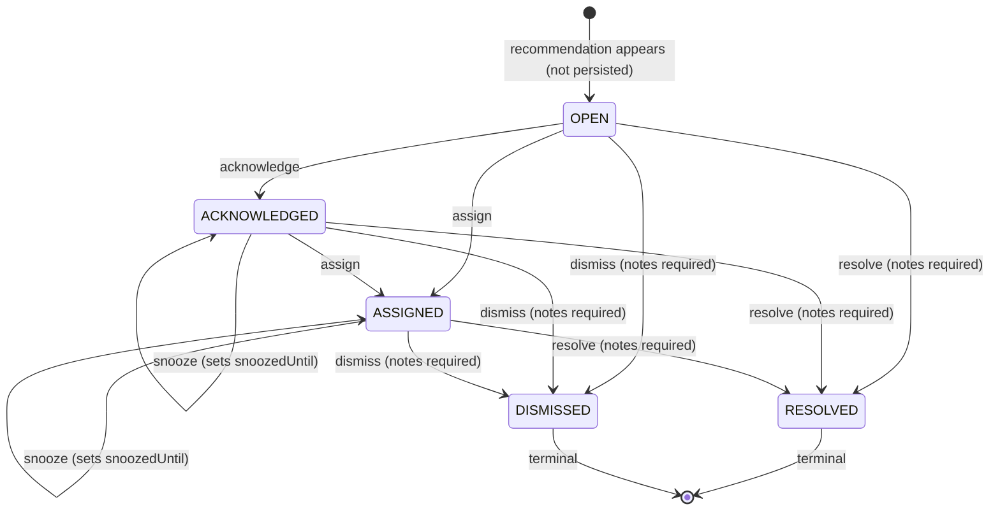

# Operational Execution Layer — Technical Notes

**Work order:** WO-ARGOS-026 (Operational Execution Layer)
**Status:** IMPLEMENTED. Real code, real database, real screenshots.
**Mission:** the first execution layer on top of Operational Intelligence (WO-ARGOS-025) — turning a recommendation an operator can only _read_ into one they can _act on_, closing the exact gap [OPERATIONAL_INTELLIGENCE_TECHNICAL_NOTES.md](./OPERATIONAL_INTELLIGENCE_TECHNICAL_NOTES.md) named as a known limitation ("no acknowledge/dismiss action").
**Schema change:** the one migration this work order's own instructions anticipated ("keep schema changes to the absolute minimum," not "none") — a single new table, `Action`, plus three small enums. No CAP-010 work. This is deliberately **not** `Alert`/`Incident`/`MaintenanceTicket` (the CAP-X Operator Control Center architecture, [CAP-X_INCIDENT_FLOW.md](../domain/CAP-X_INCIDENT_FLOW.md)) — a narrower entity scoped only to `RecommendationService`'s own five outputs, not to raw device/connectivity faults.

## What shipped

### Schema (`apps/movos-api/prisma/schema.prisma`, migration `20260808072248_add_action_execution_layer`)

- **`enum RecommendationType`** — mirrors `packages/shared-types`' existing TS type exactly (5 values).
- **`enum RecommendationSeverity`** — `HIGH`/`MEDIUM`, uppercase. This required correcting `ApiRecommendation.severity` (shipped in WO-ARGOS-025 as lowercase `'high'/'medium'`) to match — the one status-vocabulary value in this API that didn't follow [OPERATIONAL_VOCABULARY.md](../product/OPERATIONAL_VOCABULARY.md)'s UPPER_CASE convention. Fixed at the source (`RecommendationService`, the frontend widget, and the unit tests) rather than introducing a second casing convention alongside a real Prisma enum.
- **`enum ActionStatus`** — Objective 3's five states exactly.
- **`model Action`** — one table. Snapshots the recommendation's `title`/`severity`/`explanation`/`evidence`/`recommendedAction` at the moment of first interaction (Objective 5), plus workflow fields (`status`, `assignedToUserId`, `snoozedUntil`, `notes`) and timestamps (`createdAt`/`updatedAt`/`resolvedAt`). Real foreign keys to `Organization`, `ChargingStation`, and `User` (`assignedTo`), following this schema's established tenant-scoping and relation conventions — not a bare string column.
- Generated via the same scratch-database discipline used for every prior migration in this engagement (`prisma migrate diff` against a scratch DB seeded only with this branch's own migration history), applied cleanly to both the scratch DB and `movos_dev` with a single additive transaction — no data-loss operation, no enum-same-transaction split needed.

### Backend (`apps/movos-api/src/recommendations/`)

- **`action.service.ts`** — `ActionService`, the one write path onto `Action`. `create()` (first interaction — snapshots the live recommendation, or reuses an existing non-terminal Action for the same station/type instead of duplicating), `transition()` (state-machine-enforced), `findRelevant()` (the merge logic described below), `list()`.
- **`action.controller.ts`** — `GET /actions` (list, optional `status` filter), `POST /actions` (create/first-transition), `PATCH /actions/:id` (transition). Every transition is validated server-side against `ActionStatus`'s real allowed-transitions map — a disabled frontend button is a courtesy, not the enforcement mechanism.
- **`recommendation.controller.ts`** (updated) — `GET /recommendations` now enriches each live recommendation with its currently-relevant `Action`, if any, via `ActionService.findRelevant()`. `RecommendationService` itself is untouched and remains pure/stateless, exactly as WO-ARGOS-025 built it.

### Frontend (`apps/movos-web/src/components/operator/`)

- **`action-buttons.tsx`** — the acknowledge/assign/snooze/resolve/dismiss control rendered on each Operational Intelligence card, showing only the transitions the current state actually allows.
- **`operational-actions-section.tsx`** — Objective 4's "Acciones operativas" dashboard section: three columns (Pendientes / Asignadas / Resueltas) built from `GET /actions`, independent of whether the originating recommendation is still live.
- Both wired into `operator-live.tsx`, on the real `/dashboard` page.

## The state diagram

## Two honest asymmetries, named rather than hidden

### Why `OPEN` is never persisted

Objective 3 names `OPEN` as a real state, but this implementation never writes a row with `status = 'OPEN'` — the enum value exists in the schema (completeness, and room for a future explicit "reopen" action) but no code path produces it. The reasoning: pre-creating an `Action` row for every recommendation `RecommendationService` computes — which changes every request — would turn every dashboard load into a database write, for recommendations no operator has looked at yet. Instead, `OPEN` is the _implicit_ state of a live recommendation with no matching `Action` row at all: the frontend and `findRelevant()` both treat "no Action found" as equivalent to OPEN, and the very first real interaction (whichever of the five transitions the operator picks) creates the row already carrying that transition's result, never a separate "open" write followed by a second "acknowledge" write.

### The fifth action

Objective 1 names four actions an operator can take — acknowledge, assign, snooze, resolve — but Objective 3 names five states, including `DISMISSED`. Four actions cannot reach five states; `DISMISSED` has no trigger among the four named ones. Rather than leave it unreachable, a fifth action (`dismiss`) was added, mirroring `resolve`'s shape (requires notes, sets `resolvedAt`) but semantically distinct: `RESOLVED` means the underlying problem was actually fixed; `DISMISSED` means the recommendation was reviewed and judged not to need action (a false positive, an acceptable known condition). Both terminal states share the same `notes` field and the same `resolvedAt` timestamp column — one field each, not doubled, since exactly one of the two terminal paths can ever apply to a given row.

## Preserving explainability (Objective 5)

Every `Action` row is a permanent, immutable record of four things, all present in every screenshot below:

- **The recommendation** — `recommendationType`, `title`, `explanation`, all snapshotted verbatim from the live `ApiRecommendation` at the moment of first interaction, not a live reference that could drift or vanish.
- **The evidence** — the exact `evidence` array (the same bullet points a screenshot of the live card would show) stored as JSON on the row.
- **The operator's decision** — `status`, `assignedToUserId`/`assignedToUserName`, `snoozedUntil` — the literal sequence of choices made, in order, via `updatedAt`.
- **The resolution** — `notes` and `resolvedAt` for whichever terminal transition occurred.

This is why the snapshot exists at all instead of just storing `recommendationType` + `stationId` and re-deriving everything else later: `RecommendationService` is explicitly stateless and re-derives its output from current data on every call, so a condition that clears will simply stop appearing — without the snapshot, an Action created today would have no record of what it was actually about once the underlying data moved on.

## The cooldown window (undocumented by the work order, a design decision this implementation had to make)

Once an `Action` reaches `RESOLVED`/`DISMISSED`, does the recommendation immediately become eligible for a brand-new `Action` if `RecommendationService` still detects the same condition (e.g., the operator marked it resolved slightly before the underlying data caught up)? Immediate re-eligibility would flicker the UI between "resolved" and "needs action" on every poll. This implementation uses a **60-minute cooldown**: `findRelevant()` keeps returning a terminal Action (so the card shows its resolved/dismissed state) for 60 minutes after `resolvedAt`, after which — if the condition is still genuinely present — it reads as fresh again and a new `Action` row can be created. This was validated live during this session: an `Action` resolved in one test run had genuinely fallen outside its cooldown window by the time screenshots were taken hours later, and the corresponding recommendation correctly read as fresh again with a full button row — real evidence the mechanism works, not a hypothetical.

## Real validation performed

1. **`pnpm typecheck`** (root, all 12 workspace projects) — clean.
2. **`pnpm lint`** (`movos-api`, `movos-web`) — clean.
3. **`jest`** in `movos-api` — 292/292 pass (18 new for `ActionService`, covering every transition, every validation error, and the cooldown boundary), zero regressions.
4. **`vitest run`** in `movos-web` — 41/41 pass, zero regressions.
5. **`jest --config test/jest-e2e.json`**, against a separate scratch database (`movos_test`) — 22/22 pass. `test/setup-e2e.ts`'s `resetDatabase()` was updated to delete `Action` rows in the correct FK order.
6. **Real-database + real-HTTP validation** against `movos_dev`: exercised the full state machine live — `acknowledge` → `assign` → `snooze` → `resolve`, plus a direct `OPEN → DISMISSED` path, plus confirmed invalid transitions correctly return HTTP 409 (wrong state) and HTTP 400 (missing required fields — no assignee, no resolution notes).
7. **Real browser validation** (Playwright/Chromium, logged in as the seeded Kylum Energy admin): confirmed action buttons render per-state, confirmed the "Acciones operativas" section correctly groups into Pendientes/Asignadas/Resueltas with real station names, real assignee names, and real resolution notes visible. See `docs/implementation/screenshots-operational-execution/`.

## Known limitations, stated plainly

- **"Asignarme" (assign to self) is the only assignment path in the UI.** No organization-members-list endpoint exists yet to populate a picker of teammates — building one was out of this work order's scope. The backend itself is not limited to self-assignment (`assignedToUserId` accepts any user with an active membership in the organization); only the frontend control is.
- **The 60-minute cooldown window is a judgment call, not a value the work order specified.** A real deployment might tune it per recommendation type (an idle connector probably needs a shorter cooldown than a slow efficiency drift).
- **No notification delivery.** An assigned Action does not email or page anyone — consistent with [CAP-X_OPERATOR_DOMAIN.md](../domain/CAP-X_OPERATOR_DOMAIN.md)'s own scope boundary for the (still unbuilt) full Alert/Incident architecture: this domain defines when a record changes state, not how a human is notified of it.
- **No pagination on `GET /actions`** — capped at 100 rows, fine at pilot scale.

## Screenshots

`docs/implementation/screenshots-operational-execution/`:

- `01-dashboard-full.png` — the complete dashboard.
- `02-recommendation-cards-with-actions.png` — Operational Intelligence cards showing live, per-state action controls (acknowledged, assigned, and untouched states all visible simultaneously).
- `03-operational-actions-section.png` — the "Acciones operativas" section with real Pendientes/Asignadas/Resueltas groupings, including two resolved items with their real, distinct resolution notes.

## Demo

Navigable locally: `pnpm --filter @mediafox/movos-api dev` (port 4000) + `pnpm --filter @mediafox/movos-web dev` (port 3002), log in as the seeded Kylum Energy admin, land on `/dashboard`. Action controls are directly on each "Inteligencia operativa" card; the "Acciones operativas" section sits immediately below it.
