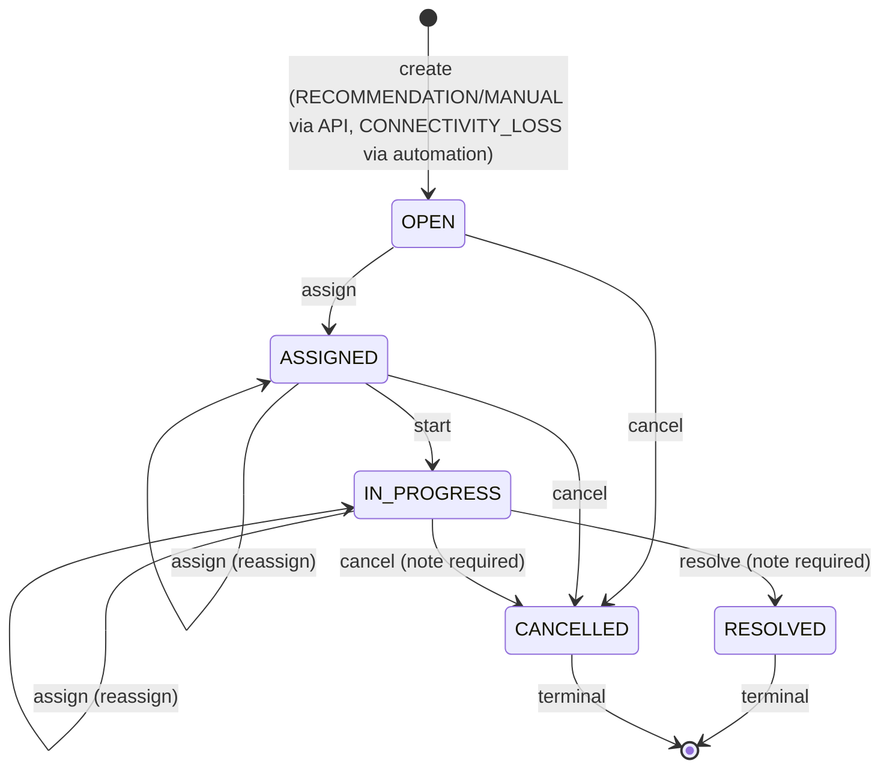

# Work Order V1 — Technical Notes

**Work order:** WO-ARGOS-035 (Work Order V1 Implementation)
**Status:** IMPLEMENTED. Real schema, real migration, real API, real UI, real automation, real screenshots — not a prototype.
**Mission:** the first execution layer that coordinates a person, not just a station's status, around an operational problem — closing the gap [FIVE_MINUTE_OPERATOR_SIMULATION.md](../product/FIVE_MINUTE_OPERATOR_SIMULATION.md) (WO-ARGOS-032) named as its sharpest finding: "a station going offline never becomes a tracked case at all."

## What shipped

### Schema (`apps/movos-api/prisma/schema.prisma`, migration `20260809065247_add_work_order_v1`)

Two new models — `WorkOrder`, `WorkOrderEvent` — and four new enums (`WorkOrderStatus`, `WorkOrderPriority`, `WorkOrderSource`, `WorkOrderEventType`). A deliberately smaller slice of [WORK_ORDER_DOMAIN.md](../operations/WORK_ORDER_DOMAIN.md) (WO-ARGOS-033)'s full proposal: no `Technician` entity (assignment is to a real `User`, via `assignedMemberId`, mirroring `Action.assignedToUserId`), no `connectorId`/`incidentId`/`dueAt`/`slaMinutes`/`evidence`, 5 statuses instead of 6 (no `BLOCKED`), 3 sources instead of 5 (`CONNECTIVITY_LOSS`, `RECOMMENDATION`, `MANUAL` only — `CUSTOMER_REPORT` and `MAINTENANCE` explicitly excluded, matching [WORKORDER_READINESS.md](../operations/WORKORDER_READINESS.md) (WO-ARGOS-034)'s own recommendation to scope the first implementation to exactly the sources with a complete, evidenced actor chain).

Applied via the same scratch-database discipline every prior migration in this engagement has used — verified on a scratch DB, then applied to `movos_dev` and `movos_test`.

### Backend (`apps/movos-api/src/work-orders/`)

- **`work-order.service.ts`** — `WorkOrderService`, the one write path onto `WorkOrder`. `create()`, `transition()` (state-machine-enforced against a real `VALID_TRANSITIONS` map, the same discipline `ActionService` established), `list()`, `getById()`, `listEvents()`. Every transition writes a real `WorkOrderEvent` row — the history log `Action` never got ([LEARNING_SIGNALS.md](../product/LEARNING_SIGNALS.md) signal 5), built into `WorkOrder` from day one instead of repeated as a gap.
- **`work-order.controller.ts`** — `GET /work-orders` (list, optional status filter), `GET /work-orders/:id`, `GET /work-orders/:id/events`, `POST /work-orders` (create — DTO-restricted to `RECOMMENDATION`/`MANUAL`, `CONNECTIVITY_LOSS` is never operator-submitted), `PATCH /work-orders/:id` (transition).
- **`work-order-automation.service.ts`** — Rule 1's real implementation: a `setInterval`-based sweep, the same pattern (`unref()`, `OnModuleDestroy`/`clearInterval`) `ConnectionRegistryService`'s own stale-connection sweep already established, reused rather than adding a new scheduling dependency (`@nestjs/schedule` is not part of this workspace). Checks every `ACTIVE` station whose `connectivityStatus` is `OFFLINE` and `lastDisconnectedAt` is more than 15 minutes old — the exact window CAP-005's own reconnect-recovery logic already uses, reused rather than invented — and creates a `WorkOrder` (`source: CONNECTIVITY_LOSS`, `priority: HIGH`) if one doesn't already exist and open for that station.
- **`presenters.ts`** — `toApiWorkOrder`/`toApiWorkOrderEvent` added, following the exact projection discipline every other entity in this API already uses.

### Rule 2 — a real button, not an automation

"Critical recommendation → allow operator to create WorkOrder" is implemented exactly as worded: a `CreateWorkOrderFromRecommendationButton`, shown on any `HIGH`-severity card in the existing `OperationalIntelligenceWidget` (WO-ARGOS-025/026, unmodified otherwise), that creates a real `WorkOrder` with `source: RECOMMENDATION` and links straight to its detail page. No `CRITICAL` recommendation tier exists in `RecommendationSeverity` (still `HIGH`/`MEDIUM` only) — this button reads "critical" as "the real severity ceiling that exists today," the same resolution [WORK_ORDER_AUTOMATIONS.md](../operations/WORK_ORDER_AUTOMATIONS.md) already proposed for this exact open question.

### Frontend (`apps/movos-web`)

- **`/work-orders`** — list view: title, station, technician (`assignedMemberName`), source, status, age, a status filter, and a real creation form for `MANUAL` orders (title, description, priority, station — station options composed client-side from `GET /sites` + `GET /sites/:siteId/charging-stations`, the same real per-site composition `/network` would use, extracted here into a shared `useAllStations` hook rather than duplicated).
- **`/work-orders/[id]`** — detail view: incident summary, station summary (fetched directly via `GET /charging-stations/:id`, linking to the real existing station detail route), assigned-technician panel with the real transition controls (`Asignarme`/`Iniciar trabajo`/`Resolver`/`Cancelar`, only the ones the current status actually allows — the same "state machine drives the UI, not the other way around" discipline `ActionButtons` established), notes with a live comment box, a full event timeline, and a derived status-history section.
- **`work-order-badges.tsx`** — one canonical status/priority/source vocabulary, the same discipline [OPERATIONAL_VOCABULARY.md](../product/OPERATIONAL_VOCABULARY.md) already established for every other status enum in this app.

**Where this lives in navigation:** the console redesign (WO-ARGOS-030/031) is still an open, unmerged PR at the time of this work order — `/work-orders` was added to the real, currently-merged sidebar (`Resumen`/`Sitios`/.../`Alertas`/`Reportes`), not the redesigned one, so this PR doesn't depend on another one merging first. Once the console redesign lands, `/work-orders` should move into the secondary nav group [WORK_ORDER_UI.md](../operations/WORK_ORDER_UI.md) already proposed for it.

## The state machine actually implemented

`comment` is valid from `OPEN`/`ASSIGNED`/`IN_PROGRESS` (not modeled as a state transition above since it never changes `status`) and updates both the current `notes` field and appends a `COMMENTED` event.

## Real validation performed

1. **`pnpm --filter @mediafox/movos-api typecheck`** — clean.
2. **`pnpm --filter @mediafox/movos-api test`** — 311/311 pass (19 new for `WorkOrderService`: every transition, every validation error, terminal-state rejection, reassignment), zero regressions.
3. **`pnpm --filter @mediafox/movos-api lint`** — clean.
4. **`pnpm --filter @mediafox/movos-web typecheck`**, **`lint`**, **`test`** (41/41), **`build`** — all clean; `/work-orders` and `/work-orders/[id]` both compile and statically/dynamically generate correctly.
5. **Real-database + real-boot validation**: migration applied and verified on a scratch DB, then `movos_dev` and `movos_test`; API booted from a clean build (`node dist/main.js`) against real PostgreSQL.
6. **Real-browser validation** (Playwright/Chromium, logged in as the seeded Kylum Energy admin): confirmed Rule 2's button creates a real `WorkOrder` from a live `HIGH` recommendation and links to it; confirmed Rule 1's automation sweep created a real `WorkOrder` for a genuinely offline seeded station with no manual trigger at all (visible in the list with a real "hace 3 min" age, created entirely by the background sweep during the session); exercised the full manual-creation flow and the complete `assign → start → resolve` transition chain end to end, with the resulting timeline and status history both showing every real event in order. See `docs/implementation/screenshots-work-orders/`.

## Known limitations, stated plainly

- **Assignment is self-assign only**, same limitation `ActionButtons` already has and for the same reason — no members-list endpoint exists yet to populate a picker of teammates.
- **No `Technician` entity** — `assignedMemberId` is a real MOVOS user, not a field technician. [TECHNICIAN_MODEL.md](../operations/TECHNICIAN_MODEL.md)'s design remains unimplemented; this version coordinates who _owns_ a problem inside the product, not who is physically dispatched to fix it.
- **No SLA tracking** — no `dueAt`/`slaMinutes` in this version, so [WORK_ORDER_AUTOMATIONS.md](../operations/WORK_ORDER_AUTOMATIONS.md) Rule 3 (SLA exceeded → escalate) has nothing to trigger on yet.
- **Rule 1's sweep runs every 60 seconds, in-process** — same single-instance constraint `ConnectionRegistryService` already operates under (CAP-003 Architecture Decision 6); a future multi-instance deployment would need to revisit this the same way it would need to revisit that.
- **`CUSTOMER_REPORT` and `MAINTENANCE` sources are not implemented at all** — not stubbed, not partially wired, simply absent from the enum, per this work order's explicit scope restriction.
