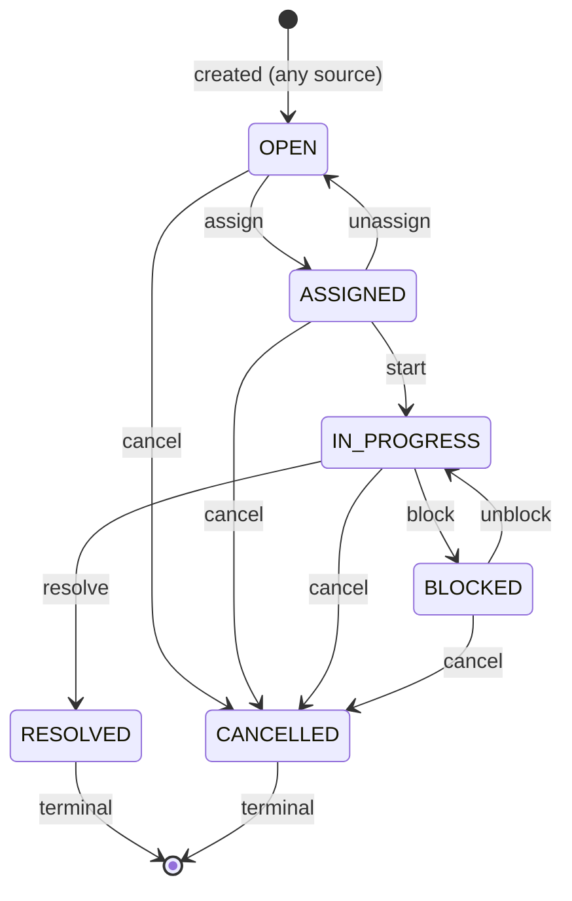

# Work Order States

**Work order:** WO-ARGOS-033 (Operational Work Orders)
**Status:** DOMAIN DESIGN. No code, API, migration, or `schema.prisma` change.
**Mission:** the `WorkOrderStatus` state machine — six states, the transitions between them, who can trigger each, and what each transition requires. This document follows the exact discipline [OPERATIONAL_EXECUTION_LAYER_TECHNICAL_NOTES.md](../implementation/OPERATIONAL_EXECUTION_LAYER_TECHNICAL_NOTES.md) already established for `Action`: a server-enforced transition map, never a client-trusted button — adapted here for `WorkOrder`'s richer, technician-involving lifecycle.

## The state diagram

## Why `IN_PROGRESS` is only reachable through `ASSIGNED`

This is a business rule, not just a technical constraint: work cannot physically start without someone assigned to do it. Unlike `Action`'s `OPEN` state (never persisted — see [OPERATIONAL_EXECUTION_LAYER_TECHNICAL_NOTES.md](../implementation/OPERATIONAL_EXECUTION_LAYER_TECHNICAL_NOTES.md)'s "why OPEN is never persisted"), `WorkOrder.OPEN` **is** a real, persisted, often long-lived state — every `WorkOrder` created by an automation rule ([WORK_ORDER_AUTOMATIONS.md](./WORK_ORDER_AUTOMATIONS.md)) starts here and may sit unassigned for a real, measurable amount of time. That waiting time is itself a meaningful operational fact (see [WORK_ORDER_UI.md](./WORK_ORDER_UI.md)'s "age" column), not a state to skip past.

## The transitions

| Transition   | From → To                                             | Required input         | Who triggers it                                                                                                                                 | Logged as                                                                                  |
| ------------ | ----------------------------------------------------- | ---------------------- | ----------------------------------------------------------------------------------------------------------------------------------------------- | ------------------------------------------------------------------------------------------ |
| **assign**   | `OPEN → ASSIGNED`                                     | `assignedTechnicianId` | Operator                                                                                                                                        | `WorkOrderEvent{type: ASSIGNED}`, sets `assignedAt`, computes `dueAt` from `slaMinutes`    |
| **unassign** | `ASSIGNED → OPEN`                                     | optional note          | Operator                                                                                                                                        | `WorkOrderEvent{type: STATUS_CHANGED}`, clears `assignedTechnicianId`/`assignedAt`/`dueAt` |
| **start**    | `ASSIGNED → IN_PROGRESS`                              | none required          | Operator, on the technician's behalf (see [TECHNICIAN_MODEL.md](./TECHNICIAN_MODEL.md) — technicians don't have product access in this version) | `WorkOrderEvent{type: STATUS_CHANGED}`                                                     |
| **block**    | `IN_PROGRESS → BLOCKED`                               | note (why)             | Operator                                                                                                                                        | `WorkOrderEvent{type: STATUS_CHANGED, note}`                                               |
| **unblock**  | `BLOCKED → IN_PROGRESS`                               | optional note          | Operator                                                                                                                                        | `WorkOrderEvent{type: STATUS_CHANGED}`                                                     |
| **resolve**  | `IN_PROGRESS → RESOLVED`                              | note (resolution)      | Operator                                                                                                                                        | `WorkOrderEvent{type: STATUS_CHANGED, note}`, sets `resolvedAt`                            |
| **cancel**   | `OPEN`/`ASSIGNED`/`IN_PROGRESS`/`BLOCKED → CANCELLED` | note (reason)          | Operator                                                                                                                                        | `WorkOrderEvent{type: STATUS_CHANGED, note}`                                               |

Every transition writes a real `WorkOrderEvent` row ([WORK_ORDER_DOMAIN.md](./WORK_ORDER_DOMAIN.md)) — the history log `Action` never got, closing [LEARNING_SIGNALS.md](../product/LEARNING_SIGNALS.md) signal 5's gap for this entity from day one instead of repeating it.

## Assignment is a soft-checked business decision, not a hard-blocked one

`assign` requires a `Technician`, but this document does not propose hard-blocking assignment to a technician whose `availability` is not `AVAILABLE`. An operator facing a `CRITICAL` priority work order and only an `ON_JOB` technician available needs to be able to make that call — the product's job is to show the conflict clearly (the technician's real current availability, visible at assignment time), not to prevent an operator from making a judgment call the system can't fully evaluate. This mirrors the same restraint `Action.transition()`'s `assertAssignee()` already shows — it validates the assignee has a real, active membership, but never second-guesses _which_ active member the operator picks.

## Priority and default SLA targets — a proposal, not a fixed fact

The mission's `priority` enum (`LOW`/`MEDIUM`/`HIGH`/`CRITICAL`) has no stated default `slaMinutes` per level. A reasonable starting proposal, offered for real business input rather than asserted as settled:

| Priority   | Proposed default `slaMinutes`    | Rationale                                                                                                                                                                                                |
| ---------- | -------------------------------- | -------------------------------------------------------------------------------------------------------------------------------------------------------------------------------------------------------- |
| `CRITICAL` | 120 (2 hours)                    | A station-down, revenue-blocking condition — matches the urgency [FIVE_MINUTE_OPERATOR_SIMULATION.md](../product/FIVE_MINUTE_OPERATOR_SIMULATION.md) implicitly assumed for its offline-station scenario |
| `HIGH`     | 480 (8 hours, same business day) | Matches `Action.severity`'s existing `HIGH` tier                                                                                                                                                         |
| `MEDIUM`   | 1440 (24 hours)                  | Matches `Action.severity`'s existing `MEDIUM` tier                                                                                                                                                       |
| `LOW`      | 4320 (3 business days)           | Routine/scheduled work, no urgency pressure                                                                                                                                                              |

These numbers are a starting proposal in the same spirit as the Action Center's own 60-minute cooldown window — a judgment call this document makes explicit rather than a value the mission specified, tunable later once real work-order data exists to check it against (the same discipline [LEARNING_METRICS.md](../product/LEARNING_METRICS.md) already established for tuning recommendation thresholds).

## What this state machine deliberately leaves out

- **No automatic transition on SLA breach.** [WORK_ORDER_AUTOMATIONS.md](./WORK_ORDER_AUTOMATIONS.md) Rule 3 (SLA exceeded → escalate) is explicitly an _escalation_, not a state change — a breached `WorkOrder` stays in whatever status it was in, flagged as overdue, not forced into a new status. Escalation and state are different axes; conflating them would make "overdue" a status instead of a computed, always-current fact derivable from `dueAt`.
- **No reopen transition from `RESOLVED`.** Mirrors `Action.status`'s own `OPEN` value, kept in the enum for a future explicit-reopen action but never built — same restraint applied here: if a resolved `WorkOrder`'s underlying problem recurs, the honest design is a _new_ `WorkOrder` (linked via `incidentId`/`stationId` continuity), not a reopened old one, consistent with how `Action`'s own cooldown-then-fresh-row pattern already works.
- **No concurrent-work-order-per-technician enforcement.** Named directly in [TECHNICIAN_MODEL.md](./TECHNICIAN_MODEL.md) as an honest, deliberate limitation, not an oversight.
