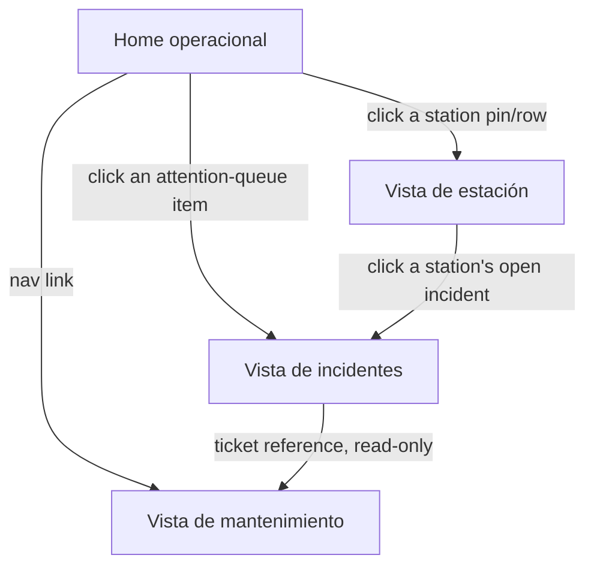

# CAP-X — MVP Screens

**Work order:** WO-ARGOS-020 (Operator Control Center MVP Definition)
**Status:** PRODUCT DISCOVERY / PLANNING. Screen descriptions in prose/layout terms only — no component, route, or UI code is implied.
**Built from:** the widget/table/action selection in [CAPX_MVP_WIDGETS.md](./CAPX_MVP_WIDGETS.md), which this document arranges into the four required screens.

## Objective 2 — The four screens

### 1. Home operacional

The landing screen — [OPERATOR_DASHBOARD.md](./OPERATOR_DASHBOARD.md)'s Zone 1/Zone 2 layout, scoped to exactly the MVP widget set.

- **Status strip:** `FLEET_STATUS`, `CONNECTIVITY`, `ACTIVE_SESSIONS`, `STUCK_SESSIONS`, `ENERGY_TODAY` — five compact glance widgets, one row.
- **Attention queue + map, side by side:** `ATTENTION_QUEUE` (ranked list, acknowledge/dismiss actions live here) and `MAP` (site pins, `StationHealth`-colored).
- **Trend, below the fold:** `TREND_CHART` (energy/session, day-over-day).
- **Session table**, below the trend chart — the same table used on the Station view (see below), here unfiltered/fleet-wide, sortable and filterable by site, station, and status.

This is the only screen using all 8 MVP widgets — the other three screens are drill-down/detail views, not additional dashboards competing for the same real estate.

### 2. Vista de estación (Station view)

Reached by drilling into any station from the Home screen's map, attention queue, or fleet-status widget.

- **Header:** station name, code, `StationHealth` state (with the plain-language reason from [CAP-X_STATION_HEALTH.md](../domain/CAP-X_STATION_HEALTH.md) — e.g., "degraded: 1 of 4 connectors faulted," not just the bare word "degraded").
- **EVSE/connector breakdown:** each connector's current status, in a small grid, not a table — there are rarely more than a handful per station, so a table's sort/filter apparatus is unwarranted here.
- **Recent alerts for this station:** a filtered slice of the same `Alert` data behind the Home screen's attention queue, scoped to this station only.
- **Recent sessions for this station:** the session table from `CAPX_MVP_WIDGETS.md`, pre-filtered to this station, with the drill-into-detail action available on each row.
- **No map on this screen** — the operator already knows which station they're looking at; a mini-map here would repeat information rather than add it.

### 3. Vista de incidentes (Incidents view)

The Incident list table plus its detail view — where assignment and resolution (actions 3 and 4 from [CAPX_MVP_WIDGETS.md](./CAPX_MVP_WIDGETS.md)) actually happen.

- **List:** the incident table (status, assignee, station, opened/resolved dates), filterable by status (`OPEN`/`INVESTIGATING`/`RESOLVED`/`CLOSED`) and by assignee ("my incidents" as a one-click filter, since [OPERATOR_DAILY_WORKFLOW.md](./OPERATOR_DAILY_WORKFLOW.md) names "which of my sites needs me" as a daily triage question an individual operator asks, not only a fleet-wide one).
- **Detail, on selecting a row:** the incident's full timeline — which `Alert`(s) it aggregates, who's assigned, and the two available actions (`Assign`, `Resolve` — resolution requires the notes field per [CAP-X_INCIDENT_FLOW.md](../domain/CAP-X_INCIDENT_FLOW.md)'s "no silent resolution" rule).
- **No `Close` action in this MVP** — [CAP-X_INCIDENT_FLOW.md](../domain/CAP-X_INCIDENT_FLOW.md) Stage 5 describes closure as a distinct, deliberate audit step separate from resolution, but it did not make the 5-action cap in [CAPX_MVP_WIDGETS.md](./CAPX_MVP_WIDGETS.md). In this MVP, a `RESOLVED` incident is the terminal state an operator interacts with; formal closure is deferred to the next phase, once the action budget has room for it. This is a stated cut, not an oversight — `RESOLVED` already carries the same "problem is fixed" meaning that matters for a first customer-facing demo.
- **No `MaintenanceTicket` creation from this screen** — consistent with [CAPX_MVP_WIDGETS.md](./CAPX_MVP_WIDGETS.md)'s scope cut, resolving an incident in this MVP is always the "direct resolution" path from [CAP-X_INCIDENT_FLOW.md](../domain/CAP-X_INCIDENT_FLOW.md), never the maintenance-ticket-gated one.

### 4. Vista de mantenimiento (Maintenance view)

The simplest of the four screens, deliberately — a **read-only table**, per [CAPX_MVP_WIDGETS.md](./CAPX_MVP_WIDGETS.md)'s explicit scope cut.

- **List:** every `MaintenanceTicket`, its status, priority, station, and scheduled date, filterable by status.
- **No create/schedule/start/complete actions on this screen in the MVP.** This view exists so the required screen has _something_ real to show — visibility into maintenance work, satisfying Objective 2's explicit requirement — without committing this 30-day window to building a full technician-dispatch workflow the discovery phase never found urgent evidence for (Maintenance was classified P1, not P0, in [OPERATOR_MODULE_PRIORITY.md](./OPERATOR_MODULE_PRIORITY.md)).
- **Honest framing for the demo:** this screen will likely show few or zero rows in an actual 30-day-old pilot, since nothing in this MVP creates a `MaintenanceTicket` through the product itself yet (see [CAPX_MVP_WIDGETS.md](./CAPX_MVP_WIDGETS.md)'s note that ticket creation happens outside the product in this cut). That is stated plainly here rather than glossed over — see [CAPX_INVESTOR_DEMO.md](./CAPX_INVESTOR_DEMO.md) for how this affects what's actually demoable.

## Navigation summary

Four screens, one primary entry point (Home), and drill-down-only navigation elsewhere — no screen requires a user to already know where something is before finding it; every path starts from the same first glance [OPERATOR_DAILY_WORKFLOW.md](./OPERATOR_DAILY_WORKFLOW.md) already established as the operator's actual daily habit.
