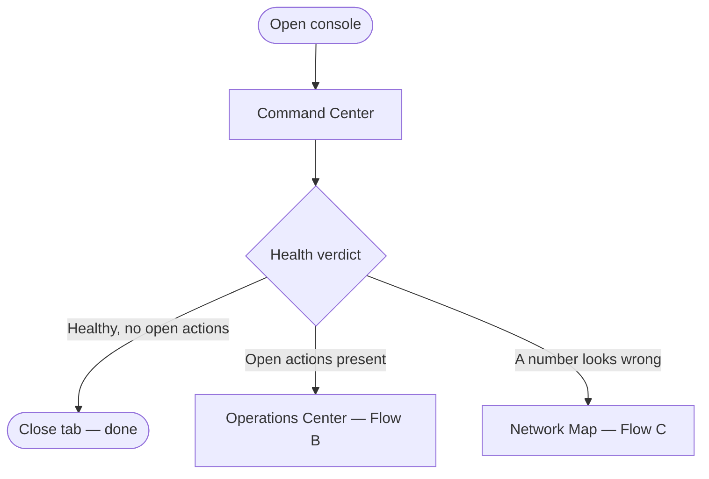
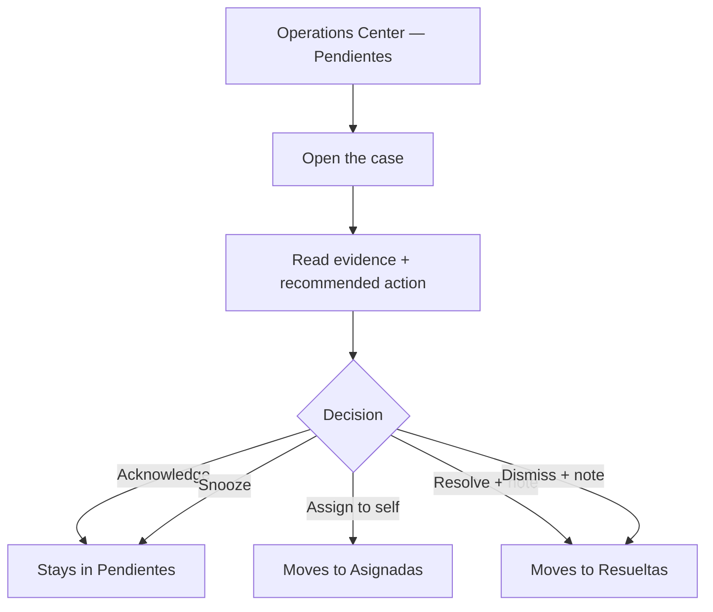

# Kylum Console — User Flows

**Work order:** WO-ARGOS-030 (Kylum Console Foundation)
**Status:** PRODUCT DESIGN. No code, API, migration, or `schema.prisma` change.
**Mission:** the operational workflows an operator actually runs through the four screens in [KYLUM_CONSOLE_INFORMATION_ARCHITECTURE.md](./KYLUM_CONSOLE_INFORMATION_ARCHITECTURE.md) — grounded in the real Action state machine (WO-ARGOS-026) and the real navigable data, not an idealized click-path.

## Flow A — the morning health check

**Trigger:** the operator opens the console for the first time that day. **This is the console's single most important flow** — everything else in this document is a branch off of it.

1. Land on **Command Center** (Screen 1) — the console's default landing screen, not a choice the operator makes.
2. Read the single health verdict in under five seconds.
3. **Branch on what the verdict says:**
   - **Healthy fleet, no open actions** → done. The operator closes the tab. This is the _successful_ outcome of the flow, not a non-event — a console that requires a click to confirm "nothing's wrong" has already failed the five-second rule.
   - **Attention needed / open actions > 0** → the operator's eye goes to the open-actions count, then clicks through to **Operations Center** (Flow B picks up here).
   - **A specific number looks wrong** (e.g., active-stations count lower than expected) → the operator clicks through to **Network Map** (Flow C picks up here).
4. **Exit state:** either done for the day, or continuing into Flow B or Flow C.

## Flow B — incident response (recommendation to resolution)

**Trigger:** an open Action exists — surfaced either from Command Center's open-actions count or directly from **Operations Center**.

1. Operator arrives at **Operations Center**, sees the case in the **Pendientes** column with its title, severity badge, and evidence summary (the same snapshot content `Action` has carried since WO-ARGOS-026).
2. Operator opens the case to read the full evidence (the exact numbers behind the recommendation — e.g., for an `ENERGY_ANOMALY`, the measured power vs. rated power) and the suggested remedy (`recommendedAction`).
3. **Decision point — the same five real transitions `ActionService` already enforces server-side:**
   - **Acknowledge** — "I've seen this, not ready to act yet." Case stays in Pendientes, now marked seen.
   - **Assign** — "I'm taking this" (self-assign is the only path today — see [KYLUM_CONSOLE_INFORMATION_ARCHITECTURE.md](./KYLUM_CONSOLE_INFORMATION_ARCHITECTURE.md)'s honest note). Case moves to the **Asignadas** column.
   - **Snooze** — "Not now, remind me later." Case stays visible but suppressed from urgent framing until the snooze window passes.
   - **Resolve** (requires a note) — "I fixed it." Case moves to **Resueltas**, the note becomes part of the permanent record.
   - **Dismiss** (requires a note) — "This isn't a real problem." Case moves to **Resueltas**, the note explains why.
4. **Exit state:** the case is either still open (acknowledged/assigned/snoozed) or terminal (resolved/dismissed) — the operator returns to Command Center, where the open-actions count has now changed to reflect the decision.

**Why this flow is the console's real product, not a feature of it:** every other screen exists to either surface a case into this flow (Command Center, Network Map) or to show its downstream business effect (Business Overview). If Flow B doesn't feel fast and clear, no amount of polish on the other three screens compensates.

## Flow C — map-driven investigation

**Trigger:** something on Command Center prompted the operator to look for _where_ a problem is, not just _that_ one exists — or the operator is doing a routine map sweep rather than responding to a specific number.

1. Operator arrives at **Network Map**, sees site pins colored by worst-status (the same precedence `StationHealthService.computeHealth()` already applies — connectivity evidence before fault evidence).
2. Operator clicks a non-healthy pin (degraded/offline/unknown), a drill-down panel opens showing that site's stations.
3. Operator clicks a specific station, the panel deepens to connector-level occupancy and the station's own health reason (e.g., "2 of 4 conectores en falla").
4. **Decision point:**
   - **There's already an open Action for this station** → operator clicks through to that case in **Operations Center**, continuing Flow B from step 2.
   - **There's no open Action yet** (the map shows a problem the Recommendation Engine hasn't — or can't yet — surface, e.g., a purely connectivity-based degradation) → operator has the station's identity in hand to act on outside the console (a phone call, a dispatched visit) — the console's honest boundary today, since there is no "create a case manually from the map" path yet ([KYLUM_CONSOLE_INFORMATION_ARCHITECTURE.md](./KYLUM_CONSOLE_INFORMATION_ARCHITECTURE.md)'s "Not real yet" column).
5. **Exit state:** either handed off into Flow B, or the operator has diagnostic information they act on outside the console.

## Flow D — business review

**Trigger:** typically not a daily flow like A–C — a weekly/periodic check, or a specific question ("is the new site paying off").

1. Operator arrives at **Business Overview**, sees the three real trends (sessions, energy delivered) and the honestly-labeled not-yet-real ones (revenue, utilization — see [KYLUM_CONSOLE_INFORMATION_ARCHITECTURE.md](./KYLUM_CONSOLE_INFORMATION_ARCHITECTURE.md)).
2. Operator scans the top-performing-stations list.
3. **Decision point:**
   - **A station stands out (very high or very low)** → operator clicks through to that station, landing on the same drill-down panel Flow C uses on **Network Map** — the two flows share their destination, not just their pattern.
   - **Nothing stands out** → done, no further action.
4. **Exit state:** either continuing into a map investigation, or done.

## Why these four flows, and not more

Every flow above either starts at or ends at Command Center or Operations Center — there is no fifth flow because there is no fifth destination that isn't already reachable from these four. A console with flows that don't connect back to the health verdict or the case queue would be adding screens for their own sake, exactly what the mission's "not a dashboard" framing warns against.
