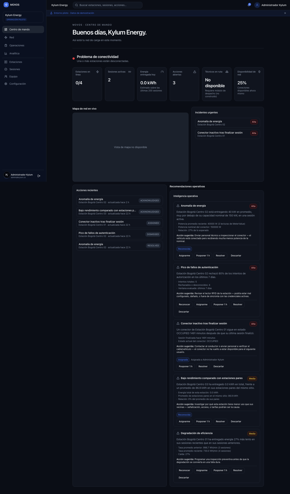
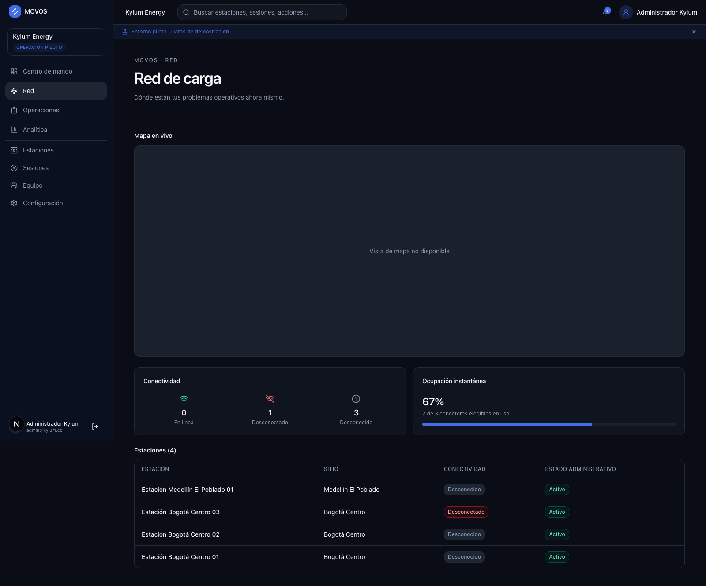
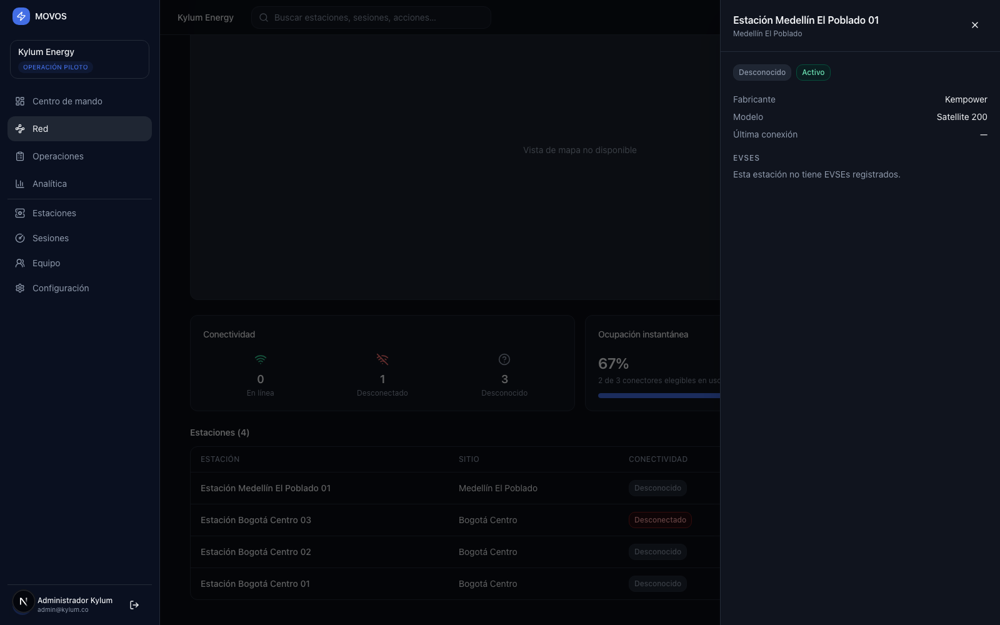
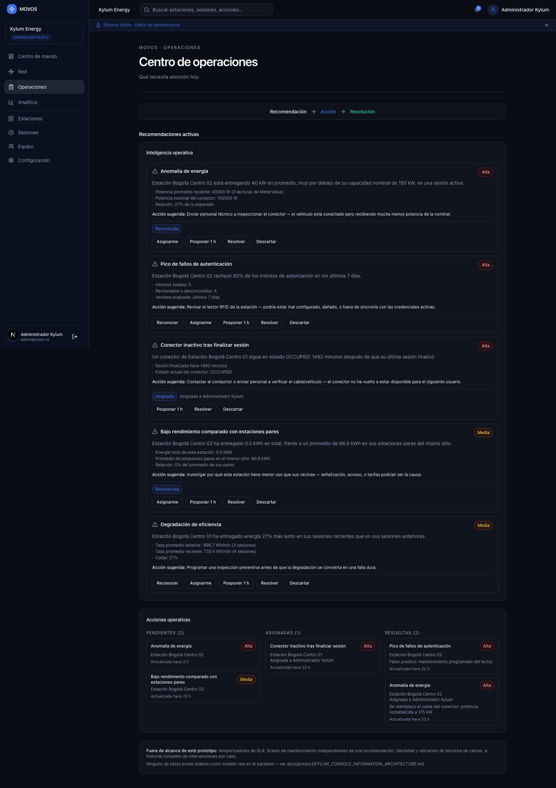
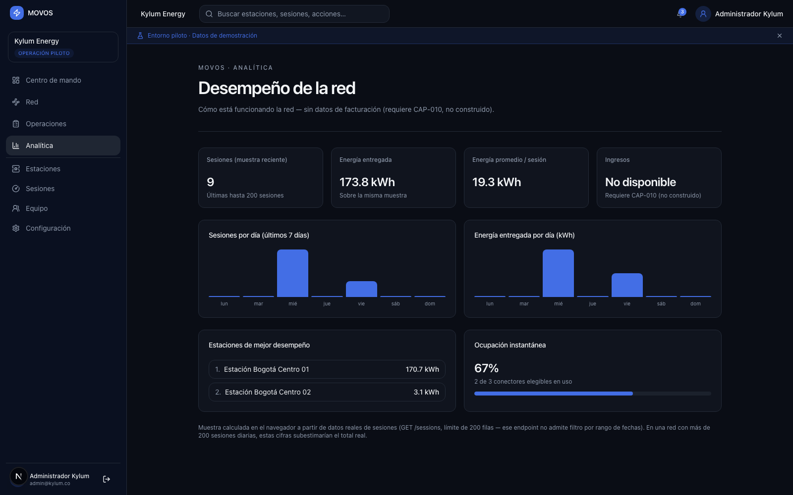
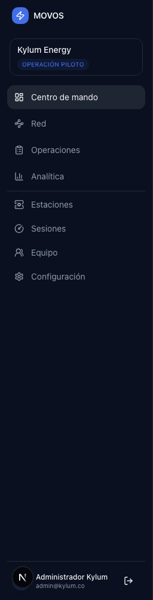

# Kylum Console — Visual Guide

**Work order:** WO-ARGOS-031 (Visual Product Prototype)
**Status:** IMPLEMENTED. Real code, real database, real screenshots — this is not a mockup. Every screenshot below was captured with Playwright against a real, freshly-built `movos-api` instance connected to real PostgreSQL data (the seeded Kylum Energy pilot org) and a real `movos-web` dev server, logged in as the seeded admin account, navigating exactly as an operator would.
**Mission:** the first navigable visual prototype of MOVOS — no code, API, migration, or backend change; desktop-first; reuses the existing design system throughout.

## What shipped

Four new routes in `apps/movos-web`, a reorganized navigation shell, a new top bar, and one shared contextual-drawer component — built directly on top of [KYLUM_CONSOLE_INFORMATION_ARCHITECTURE.md](./KYLUM_CONSOLE_INFORMATION_ARCHITECTURE.md), [KYLUM_CONSOLE_USER_FLOWS.md](./KYLUM_CONSOLE_USER_FLOWS.md), [KYLUM_CONSOLE_NAVIGATION.md](./KYLUM_CONSOLE_NAVIGATION.md), and [KYLUM_CONSOLE_DESIGN_PRINCIPLES.md](./KYLUM_CONSOLE_DESIGN_PRINCIPLES.md) (WO-ARGOS-030). Nothing here contradicts those documents; this is their execution.

- **`/command-center`** — new landing screen, replacing `/dashboard` (which now redirects here, mirroring the existing `/stations → /sites` pattern from WO-ARGOS-005).
- **`/network`** — full-screen live map, connectivity/occupancy summaries, and a real cross-site station list.
- **`/operations`** — the Recommendation → Action → Resolution workflow, full screen.
- **`/analytics`** — real, client-computed session/energy trends and station ranking. No revenue.
- **`MovosSidebar`** — reorganized into 4 primary + 4 secondary items (see [KYLUM_CONSOLE_NAVIGATION.md](./KYLUM_CONSOLE_NAVIGATION.md)).
- **`ConsoleTopBar`** — new: organization selector, search input, real notification count, operator profile.
- **`ContextDrawer`** — new: one shared slide-in drawer, used today for station detail on `/network`, ready for the same pattern anywhere else a drill-down is added.

## Screen 1 — Command Center

The five-second answer, top to bottom: one health verdict (**"Problema de conectividad"**, correctly computed from the real fleet-status counts — this org's seed data genuinely has a disconnected station), six metric cards, the live map, urgent incidents, recent actions, and the Recommendation Engine.

**What's real:** the verdict, all six cards except "Técnicos en ruta" (station connectivity, active sessions, energy delivered today, open actions, network availability — every number here comes from `/operator/fleet-status`, `/operator/connectivity`, `/operator/occupancy`, `/sessions/active`, and `/actions`), the urgent-incidents list (real `Action` rows filtered to `HIGH` severity), recent actions (real, sorted by `updatedAt`), and the full Recommendation Engine widget with its live evidence and real acknowledge/assign/snooze/resolve/dismiss controls.

**What's honestly not real:** "Técnicos en ruta" renders a plain, muted "No disponible" with an inline reason — no technician/dispatch model exists anywhere in the schema. "Energía entregada hoy" is captioned as an estimate: `GET /sessions` has no date-range filter, so this is computed client-side over the most recent 200 sessions, not a true backend rollup — accurate at this pilot's scale, and named as a limitation rather than hidden.

**Deviation from the work order's literal example, explained:** the mission text shows "🟢 Network healthy" as an example badge. The shipped verdict uses a colored status dot plus text instead of a literal emoji glyph, to stay consistent with [KYLUM_CONSOLE_DESIGN_PRINCIPLES.md](./KYLUM_CONSOLE_DESIGN_PRINCIPLES.md)'s own "avoid consumer-app aesthetics" rule (also part of this work order's design principles) — the same communicative intent, delivered through the existing status-color system instead of an emoji character.

## Screen 2 — Network

The live map (site-level, real `/operator/map` data — shown here as "Vista de mapa no disponible" because no Google Maps browser API key is configured in this local environment, `FleetMap`'s own existing, honest fallback, not something this work order introduced), connectivity and occupancy summaries, and a real station list spanning every site.

**How the station list is real without a new endpoint:** [KYLUM_CONSOLE_NAVIGATION.md](./KYLUM_CONSOLE_NAVIGATION.md) already noted the standing WO-ARGOS-005 ruling — no org-wide station-list endpoint exists, by design. This screen respects that ruling rather than working around it with a backend change: it composes the real, existing `GET /sites` and `GET /sites/:siteId/charging-stations` endpoints client-side, fetching each site's stations and flattening them into one table. Real data (4 real stations across 2 real sites in this seed), assembled in the browser instead of the database.

### Station detail drawer

Clicking a station opens the shared `ContextDrawer` — real station fields (manufacturer, model, connectivity, administrative status) plus its real EVSEs (`GET /charging-stations/:id/evses`), fetched only for the selected station. This particular station has no EVSEs registered, and the drawer says exactly that rather than showing an empty table with no explanation.

## Screen 3 — Operations

The Recommendation → Action → Resolution workflow banner sits above the real Recommendation Engine (`OperationalIntelligenceWidget`, unmodified, reused as-is) and the real three-column Action Center (`OperationalActionsSection`, unmodified, reused as-is) — both promoted from a bottom-of-dashboard section to a full screen with room to actually work a case.

**The honest-gap card at the bottom is deliberate, not a placeholder left in by accident:** SLA timers, maintenance tickets independent of a recommendation, technician identity/location, and full per-case intervention history are named explicitly as not built, cross-referencing [KYLUM_CONSOLE_INFORMATION_ARCHITECTURE.md](./KYLUM_CONSOLE_INFORMATION_ARCHITECTURE.md) rather than silently omitting what the work order's Screen 3 spec asked for.

## Screen 4 — Analytics

Four metric cards, two trend bar charts (sessions/day and energy/day, last 7 days), a station ranking by energy delivered, and instantaneous occupancy — all computed client-side from real `ChargingSession` data (`GET /sessions?limit=200`), with **zero revenue anywhere on the screen**, per the work order's explicit CAP-010 restriction. Where a widget can't be backed by real data (revenue), it says "No disponible — requiere CAP-010 (no construido)" in the same muted, honest style used throughout — never a fabricated number.

The bar charts are a small, dependency-free component (`SimpleBarTrend`) — no charting library was added to the workspace for two bar charts, consistent with the design principles' "avoid excessive charts" rule and with keeping the dependency footprint unchanged.

## Sidebar reorganization

Four primary command destinations (Centro de mando, Red, Operaciones, Analítica), a divider, then four secondary reference/administrative items (Estaciones, Sesiones, Equipo, Configuración) — exactly the structure [KYLUM_CONSOLE_NAVIGATION.md](./KYLUM_CONSOLE_NAVIGATION.md) specified, implemented in the real, shipped `MovosSidebar` component, not a parallel one.

## What was reused vs. newly built

| Reused, unmodified                                                                                                                                                                                                                                                      | Reused, extended                                                           | New                                                                                                                     |
| ----------------------------------------------------------------------------------------------------------------------------------------------------------------------------------------------------------------------------------------------------------------------- | -------------------------------------------------------------------------- | ----------------------------------------------------------------------------------------------------------------------- |
| `FleetMap`, `ConnectivityWidget`, `OccupancyWidget`, `OperationalIntelligenceWidget`, `OperationalActionsSection`, `MetricCard`, `Card`, `Badge`, `DataTable`, `ApiConnectivityStatusBadge`, `ApiChargingStationStatusBadge`, `ApiEvseStatusBadge`, `usePolledResource` | `MovosSidebar` (nav reorganized in place), `MovosShell` (top bar inserted) | `ConsoleTopBar`, `ContextDrawer`, `SimpleBarTrend`, `computeNetworkVerdict` helper, and the four page routes themselves |

No duplicate component was created for anything that already existed — every widget on all four screens is a real, previously-shipped component, composed into a new arrangement.

## Known limitations of this prototype, stated plainly

- **The map shows its existing "not available" fallback locally** because no Google Maps browser key is configured in this environment — this is `FleetMap`'s own pre-existing behavior, unrelated to this work order.
- **The station list and analytics trends both operate at bounded sample sizes** (per-site composition for stations; 200-session cap for analytics) — both honestly captioned in-product, not hidden.
- **Search in the top bar is a real input with no backend search endpoint behind it yet** — rendered honestly as a real, styled control, not wired to a live query, matching the same disclosure discipline used for every other not-yet-real element in this console.
- **The organization switcher only activates for accounts with more than one membership** — this pilot account has exactly one, so it renders as a static label, which is the honest current state, not a bug.

## Verification performed

1. `pnpm --filter @mediafox/movos-web typecheck` — clean.
2. `pnpm --filter @mediafox/movos-web lint` — clean.
3. `pnpm --filter @mediafox/movos-web build` — succeeds; all four new routes statically generated.
4. `pnpm --filter @mediafox/movos-web test` — 41/41 existing tests pass, zero regressions.
5. Real-browser validation (Playwright/Chromium) against a freshly built `movos-api` (`node dist/main.js`, real PostgreSQL, real seeded Kylum Energy data) and a real `next dev` server: logged in as the seeded admin, navigated all four screens via the real sidebar links (not direct URL loads, since the access token lives in memory only — see the in-product auth design), opened the station detail drawer, and captured every screenshot in this document live.
